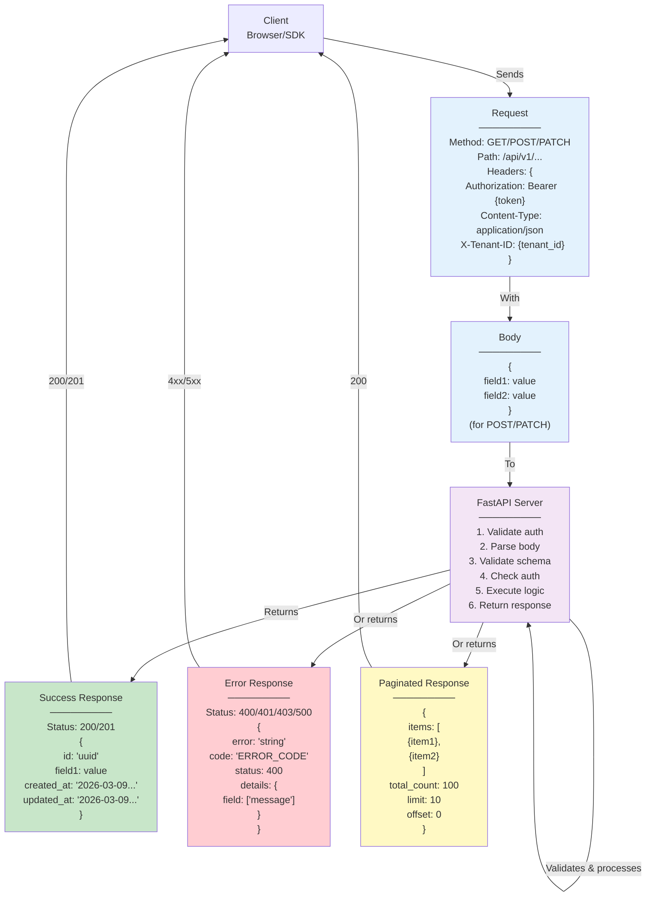
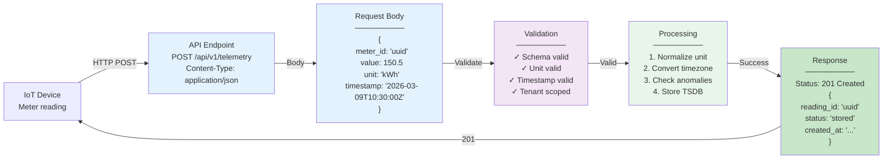
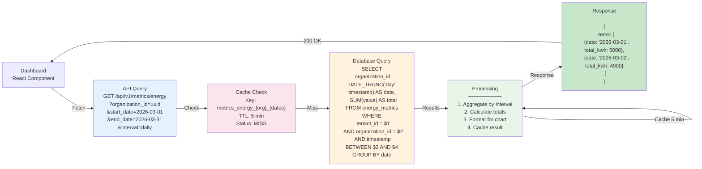
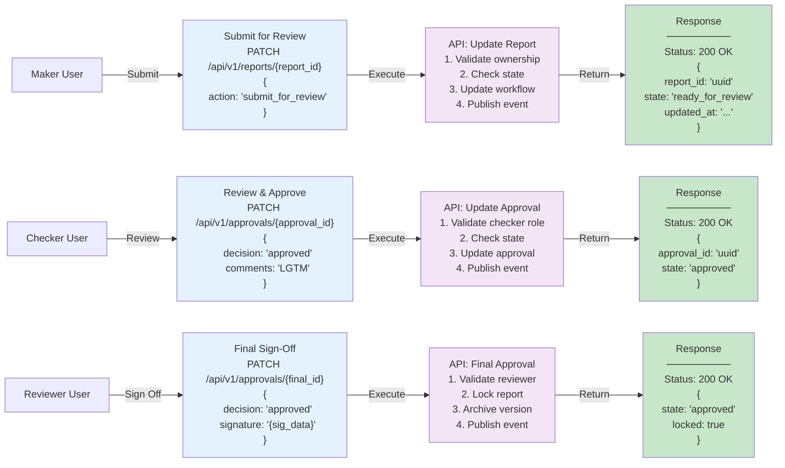
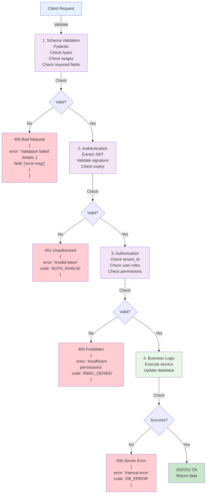
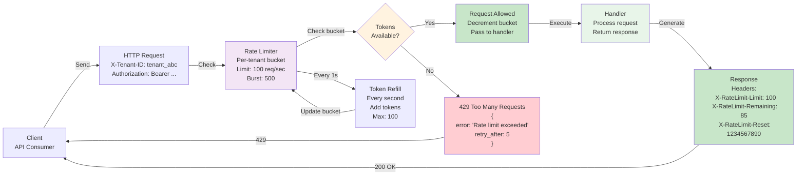

# API Interaction Diagrams

**Purpose**: REST API relationships and call flows
**Format**: Mermaid Graph Diagrams
**Last Updated**: March 9, 2026

---

## 1. Authentication Flow (OAuth2/OIDC with Keycloak)

```mermaid
graph LR
    Browser["Browser<br/>Frontend App"]
    Frontend["React App<br/>icarbon.com"]

    Keycloak["Keycloak Server<br/>OAuth2 Provider"]
    KeycloakDB["Keycloak DB<br/>Users & Roles"]

    API["FastAPI Backend<br/>API Gateway"]
    Database["PostgreSQL<br/>App Data"]

    LocalStorage["LocalStorage<br/>Tokens"]

    Browser -->|1. Click 'Login'| Frontend
    Frontend -->|2. Redirect| Keycloak
    Keycloak -->|3. Login Form| Browser
    Browser -->|4. Username/Password| Keycloak
    Keycloak -->|Validate| KeycloakDB
    Keycloak -->|5. Auth Code| Browser

    Frontend -->|6. Exchange Code<br/>POST /token| Keycloak
    Keycloak -->|7. {access_token, refresh_token}| Frontend
    Frontend -->|Store| LocalStorage

    Frontend -->|8. API Request<br/>Header: Authorization: Bearer {token}| API
    API -->|Validate JWT| Keycloak
    Keycloak -->|Valid| API
    API -->|9. Query data| Database
    API -->|10. Response + data| Frontend

    Browser -->|11. Render page| Frontend

    style Keycloak fill:#f3e5f5
    style API fill:#e3f2fd
    style LocalStorage fill:#fce4ec
```

---

## 2. Tenant Scoping & Authorization

```mermaid
graph LR
    Client["Client<br/>GET /api/v1/organizations"]

    Middleware["Auth Middleware<br/>Extract JWT<br/>Validate signature<br/>Get user claims"]

    TenantMiddleware["Tenant Middleware<br/>Extract tenant_id<br/>from token"]

    RBAC["RBAC Check<br/>user role<br/>required permissions<br/>resource access"]

    ServiceLayer["Service Layer<br/>Apply tenant filter<br/>WHERE tenant_id = $1"]

    Database["PostgreSQL<br/>Query with<br/>tenant scoping"]

    Response["Response<br/>Only user's<br/>tenant data"]

    Client -->|Request with JWT| Middleware
    Middleware -->|Valid JWT| TenantMiddleware
    TenantMiddleware -->|Extract tenant_id| RBAC

    RBAC -->|Check permissions<br/>user.roles<br/>resource.required_permission| RBAC
    RBAC -->|Allowed| ServiceLayer
    RBAC -->|Denied| Error["401 Unauthorized"]

    ServiceLayer -->|Add WHERE<br/>tenant_id clause| Database
    Database -->|Scoped results| Response
    Response -->|200 OK<br/>{data}| Client

    style Middleware fill:#e1f5ff
    style TenantMiddleware fill:#e1f5ff
    style RBAC fill:#f3e5f5
    style ServiceLayer fill:#e8f5e9
    style Database fill:#fff3e0
```

---

## 3. API Endpoint Hierarchy & Organization

```mermaid
graph TD
    API["iNetZero API<br/>Base: /api/v1"]

    AuthGroup["Authentication<br/>/auth"]
    AuthLogin["POST /auth/login"]
    AuthRefresh["POST /auth/refresh"]
    AuthLogout["POST /auth/logout"]
    AuthMe["GET /auth/me"]

    TenantGroup["Tenants<br/>/tenants"]
    TenantCreate["POST /tenants"]
    TenantGet["GET /tenants/{tenant_id}"]
    TenantUpdate["PATCH /tenants/{tenant_id}"]

    OrgGroup["Organizations<br/>/tenants/{tenant_id}/organizations"]
    OrgCreate["POST /organizations"]
    OrgList["GET /organizations"]
    OrgUpdate["PATCH /organizations/{org_id}"]

    FacilityGroup["Facilities<br/>/organizations/{org_id}"]
    SiteCreate["POST /sites"]
    SiteList["GET /sites"]
    BuildingCreate["POST /buildings"]
    BuildingList["GET /buildings"]
    ZoneCreate["POST /zones"]
    RackCreate["POST /racks"]

    AssetGroup["Assets<br/>/organizations/{org_id}/assets"]
    AssetCreate["POST /assets"]
    AssetList["GET /assets"]
    AssetUpdate["PATCH /assets/{asset_id}"]

    TelemetryGroup["Telemetry<br/>/tenants/{tenant_id}/telemetry"]
    TelemetryCreate["POST /telemetry"]
    TelemetryBatch["POST /telemetry/batch"]
    TelemetryHistory["GET /telemetry/history"]

    MetricsGroup["Metrics<br/>/tenants/{tenant_id}/metrics"]
    EnergyMetrics["GET /metrics/energy"]
    CarbonMetrics["GET /metrics/carbon"]
    KPIMetrics["GET /metrics/kpi"]

    ReportGroup["Reports<br/>/tenants/{tenant_id}/reports"]
    ReportCreate["POST /reports"]
    ReportList["GET /reports"]
    ReportGet["GET /reports/{report_id}"]
    ReportUpdate["PATCH /reports/{report_id}"]
    ReportExport["GET /reports/{report_id}/export"]

    EvidenceGroup["Evidence<br/>/tenants/{tenant_id}/evidence"]
    EvidenceUpload["POST /evidence"]
    EvidenceList["GET /evidence"]
    EvidenceLink["PATCH /evidence/{id}"]

    WorkflowGroup["Workflows<br/>/tenants/{tenant_id}/workflows"]
    ApprovalCreate["POST /approvals"]
    ApprovalUpdate["PATCH /approvals/{id}"]
    ApprovalList["GET /approvals"]

    CopilotGroup["Copilot<br/>/tenants/{tenant_id}/copilot"]
    CopilotAsk["POST /copilot/ask"]
    CopilotHistory["GET /copilot/history"]

    API -->|v1 resources| AuthGroup
    API -->|v1 resources| TenantGroup
    API -->|v1 resources| OrgGroup
    API -->|v1 resources| FacilityGroup
    API -->|v1 resources| AssetGroup
    API -->|v1 resources| TelemetryGroup
    API -->|v1 resources| MetricsGroup
    API -->|v1 resources| ReportGroup
    API -->|v1 resources| EvidenceGroup
    API -->|v1 resources| WorkflowGroup
    API -->|v1 resources| CopilotGroup

    AuthGroup --> AuthLogin
    AuthGroup --> AuthRefresh
    AuthGroup --> AuthLogout
    AuthGroup --> AuthMe

    TenantGroup --> TenantCreate
    TenantGroup --> TenantGet
    TenantGroup --> TenantUpdate

    OrgGroup --> OrgCreate
    OrgGroup --> OrgList
    OrgGroup --> OrgUpdate

    FacilityGroup --> SiteCreate
    FacilityGroup --> SiteList
    FacilityGroup --> BuildingCreate
    FacilityGroup --> BuildingList
    FacilityGroup --> ZoneCreate
    FacilityGroup --> RackCreate

    AssetGroup --> AssetCreate
    AssetGroup --> AssetList
    AssetGroup --> AssetUpdate

    TelemetryGroup --> TelemetryCreate
    TelemetryGroup --> TelemetryBatch
    TelemetryGroup --> TelemetryHistory

    MetricsGroup --> EnergyMetrics
    MetricsGroup --> CarbonMetrics
    MetricsGroup --> KPIMetrics

    ReportGroup --> ReportCreate
    ReportGroup --> ReportList
    ReportGroup --> ReportGet
    ReportGroup --> ReportUpdate
    ReportGroup --> ReportExport

    EvidenceGroup --> EvidenceUpload
    EvidenceGroup --> EvidenceList
    EvidenceGroup --> EvidenceLink

    WorkflowGroup --> ApprovalCreate
    WorkflowGroup --> ApprovalUpdate
    WorkflowGroup --> ApprovalList

    CopilotGroup --> CopilotAsk
    CopilotGroup --> CopilotHistory

    style API fill:#e3f2fd
    style AuthGroup fill:#f3e5f5
    style TenantGroup fill:#fff3e0
    style OrgGroup fill:#e8f5e9
    style FacilityGroup fill:#fce4ec
    style AssetGroup fill:#f1f8e9
    style TelemetryGroup fill:#fff9c4
    style MetricsGroup fill:#ffe0b2
    style ReportGroup fill:#ffccbc
    style EvidenceGroup fill:#c8e6c9
    style WorkflowGroup fill:#b3e5fc
    style CopilotGroup fill:#f8bbd0
```



---

## 4. Request/Response Patterns



---

## 5. Tenant Creation & Setup Flow

```mermaid
graph LR
    Admin["Admin User"]

    Step1["1. Create Tenant<br/>POST /tenants<br/>{name, slug}"]
    API1["API: Create<br/>TenantService"]
    DB1["DB: Insert<br/>tenants table"]

    Step2["2. Create Admin User<br/>POST /users<br/>{email, name}"]
    API2["API: Create<br/>UserService"]
    Keycloak["Keycloak<br/>Create user"]
    DB2["DB: Insert<br/>users table"]

    Step3["3. Assign Admin Role<br/>POST /users/{id}/roles<br/>{role: 'admin'}"]
    API3["API: Assign<br/>RoleService"]
    DB3["DB: Insert<br/>user_roles table"]

    Step4["4. Create Organization<br/>POST /organizations<br/>{org_name, settings}"]
    API4["API: Create<br/>OrgService"]
    DB4["DB: Insert<br/>organizations table"]

    Admin -->|Step 1| Step1
    Step1 -->|Execute| API1
    API1 -->|Insert| DB1

    Admin -->|Step 2| Step2
    Step2 -->|Execute| API2
    API2 -->|Create| Keycloak
    API2 -->|Insert| DB2

    Admin -->|Step 3| Step3
    Step3 -->|Execute| API3
    API3 -->|Insert| DB3

    Admin -->|Step 4| Step4
    Step4 -->|Execute| API4
    API4 -->|Insert| DB4

    DB1 -->|{tenant_id}| DB2
    DB2 -->|{user_id}| DB3
    DB3 -->|{role_id}| DB4
    DB4 -->|Ready| Admin

    style Step1 fill:#e3f2fd
    style Step2 fill:#e3f2fd
    style Step3 fill:#e3f2fd
    style Step4 fill:#e3f2fd
    style API1 fill:#f3e5f5
    style API2 fill:#f3e5f5
    style API3 fill:#f3e5f5
    style API4 fill:#f3e5f5
```

---

## 6. Telemetry Ingestion API Call Flow



---

## 7. Metrics Query API Call Flow



---

## 8. Report Approval API Call Flow



---

## 9. Error Handling & Validation



---

## 10. Rate Limiting & Throttling



---

## Common HTTP Status Codes

| Code | Meaning | Example |
|------|---------|---------|
| **200** | OK | Successful GET request |
| **201** | Created | Successful POST creating resource |
| **204** | No Content | Successful DELETE |
| **400** | Bad Request | Validation error |
| **401** | Unauthorized | Invalid/missing token |
| **403** | Forbidden | Insufficient permissions |
| **404** | Not Found | Resource doesn't exist |
| **409** | Conflict | Duplicate key / state conflict |
| **429** | Too Many Requests | Rate limit exceeded |
| **500** | Server Error | Unhandled exception |
| **503** | Service Unavailable | Maintenance mode |

---

**Navigation**: [Back to Index](./INDEX.md)
