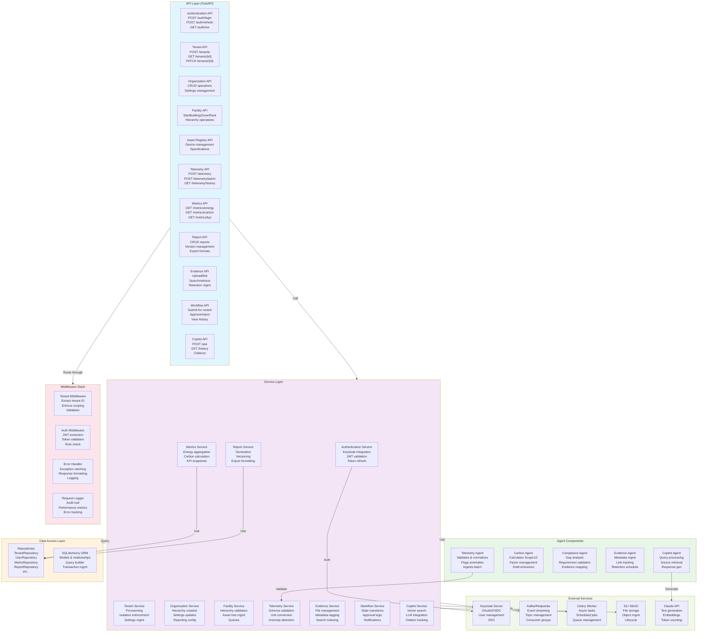
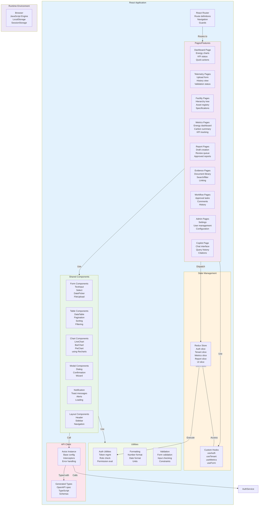
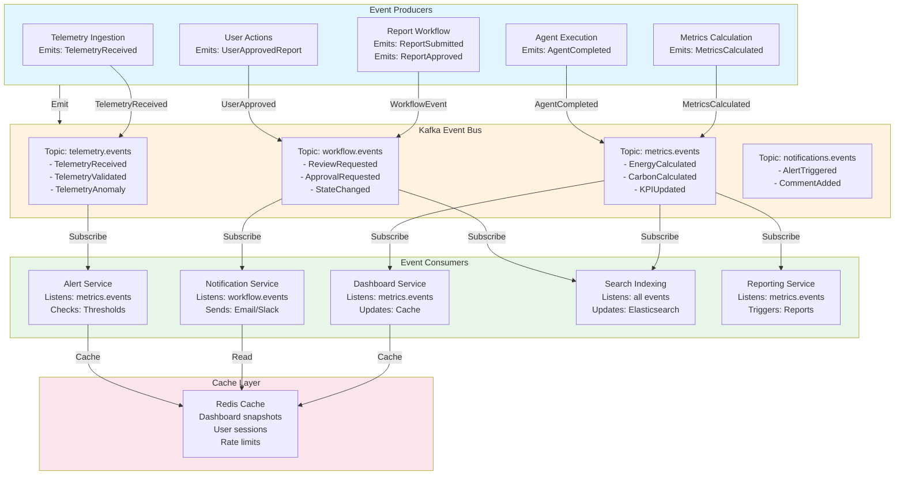
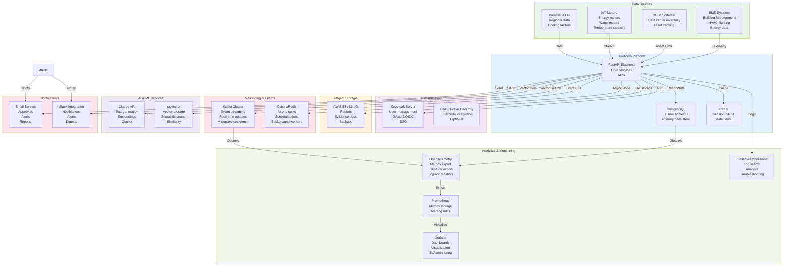
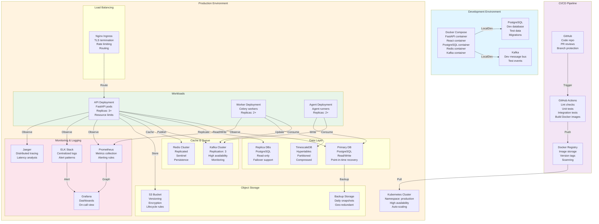

# Component Diagrams

**Purpose**: System components and service architecture
**Format**: Mermaid Component Diagrams
**Last Updated**: March 9, 2026

---

## 1. Backend Service Components



---

## 2. Frontend Component Architecture



---

## 3. Data Processing Pipeline Components

```mermaid
graph LR
    subgraph Input["Input Layer"]
        API["REST API<br/>/telemetry"]
        CSV["CSV Upload<br/>Batch import"]
        Stream["IoT Stream<br/>Real-time metrics"]
    end

    subgraph Processing["Processing Layer"]
        Validate["Validation<br/>Schema check<br/>Type conversion<br/>Range check"]
        Normalize["Normalization<br/>Unit conversion<br/>Timezone handling<br/>Deduplication"]
        Enrich["Enrichment<br/>Add metadata<br/>Link devices<br/>Map facilities"]
        Detect["Anomaly Detection<br/>Outlier check<br/>Freshness check<br/>Threshold check"]
    end

    subgraph Storage["Storage Layer"]
        TSDB["TimescaleDB<br/>Hypertables<br/>Compression<br/>Retention policy"]
    end

    subgraph Calculation["Calculation Layer"]
        Energy["Energy Aggregation<br/>Total consumption<br/>By facility<br/>By device"]
        Carbon["Carbon Calculation<br/>Scope 1/2<br/>Factor application<br/>Versioning"]
        KPI["KPI Calculation<br/>PUE, CUE, WUE<br/>Custom formulas<br/>Snapshots"]
    end

    subgraph Distribution["Distribution Layer"]
        Dashboard["Dashboard Update<br/>Pub/Sub cache<br/>WebSocket push"]
        Report["Report Generation<br/>Data aggregation<br/>PDF/JSON export"]
        Alert["Alerting System<br/>Threshold check<br/>Notification dispatch"]
    end

    Input -->|Stream| Validate
    Validate -->|Valid| Normalize
    Normalize -->|Normalized| Enrich
    Enrich -->|Ready| Detect
    Detect -->|Stored| TSDB
    TSDB -->|Query| Energy
    TSDB -->|Query| Carbon
    TSDB -->|Query| KPI
    Energy -->|Publish| Dashboard
    Carbon -->|Publish| Report
    KPI -->|Check| Alert
    Alert -->|Notify| Distribution

    style Input fill:#e1f5ff
    style Processing fill:#f3e5f5
    style Storage fill:#fff3e0
    style Calculation fill:#e8f5e9
    style Distribution fill:#fce4ec
```



---

## 4. Event-Driven Architecture Components



---

## 5. Integration & External Services Components



---

## 6. Deployment Architecture Components



---

## Component Communication Patterns

### Synchronous (Request/Response)
```
Frontend → API Gateway → Service → Database
  └─→ Response back (JSON)
```

### Asynchronous (Event-Driven)
```
Producer → Kafka Topic → Consumer → Worker → Result
  └─→ Independent execution
```

### Scheduled (Background Jobs)
```
Scheduler → Celery Queue → Worker → Result
  └─→ Periodic execution (hourly, daily, etc)
```

---

**Navigation**: [Back to Index](./INDEX.md)
