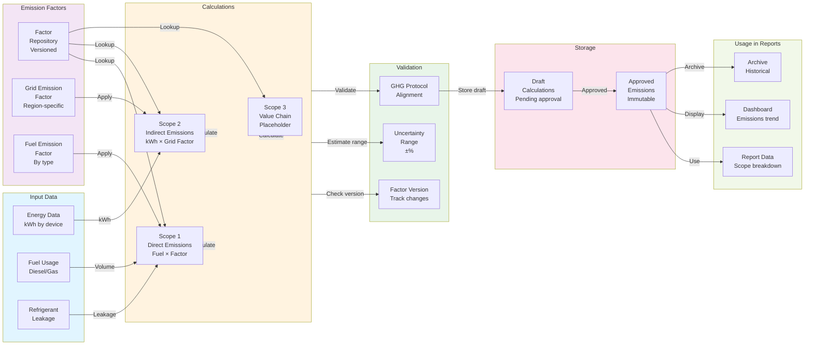
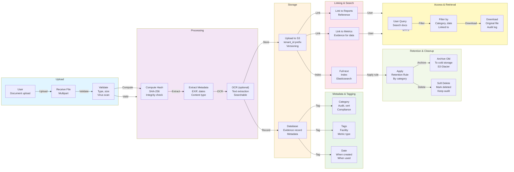
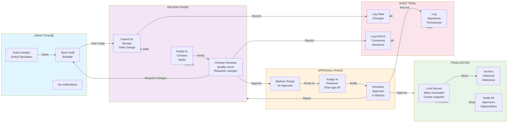
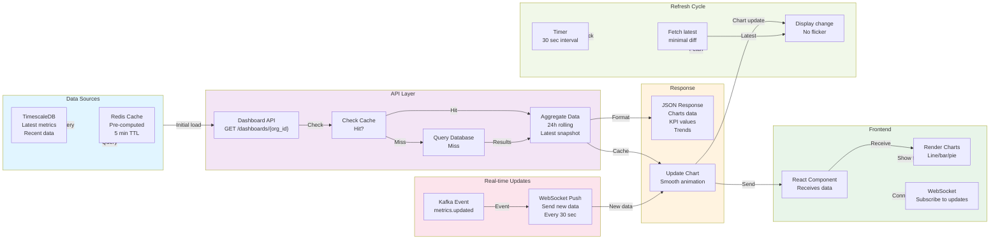

# Data Flow Diagram

**Purpose**: Information flow through the system
**Format**: Mermaid Graph Diagrams
**Last Updated**: March 9, 2026

---

## 1. End-to-End Data Flow (Ingestion → Processing → Reporting)

```mermaid
graph LR
    subgraph Input["1. DATA INGESTION"]
        Device["IoT Devices<br/>Meters"]
        CSV["CSV Upload<br/>Batch data"]
        API["REST API<br/>Direct call"]
    end

    subgraph Validation["2. VALIDATION & NORMALIZATION"]
        SchemaVal["Schema<br/>Validation"]
        UnitNorm["Unit<br/>Normalization"]
        TimestampNorm["Timestamp<br/>Normalization"]
        Dedup["Deduplication<br/>& Cleanup"]
    end

    subgraph Storage["3. STORAGE"]
        TSDB["TimescaleDB<br/>Hypertables"]
        Audit["Audit Log<br/>Immutable"]
    end

    subgraph Processing["4. PROCESSING & CALCULATION"]
        EnergyAgg["Energy<br/>Aggregation"]
        CarbonCalc["Carbon<br/>Calculation"]
        KPICalc["KPI<br/>Calculation"]
    end

    subgraph Analysis["5. ANALYSIS & INSIGHTS"]
        Anomaly["Anomaly<br/>Detection"]
        Alerting["Threshold<br/>Alerting"]
        Trending["Trend<br/>Analysis"]
    end

    subgraph Distribution["6. REPORTING & DISTRIBUTION"]
        Dashboard["Real-time<br/>Dashboard"]
        Report["PDF/JSON<br/>Reports"]
        Export["Data<br/>Export"]
    end

    Device -->|Telemetry| Input
    CSV -->|Batch| Input
    API -->|Point| Input

    Input -->|Raw data| SchemaVal
    SchemaVal -->|Valid| UnitNorm
    UnitNorm -->|Normalized| TimestampNorm
    TimestampNorm -->|Standardized| Dedup

    Dedup -->|Clean| TSDB
    Dedup -->|Record| Audit

    TSDB -->|Query| EnergyAgg
    TSDB -->|Query| CarbonCalc
    TSDB -->|Query| KPICalc

    EnergyAgg -->|Results| Anomaly
    CarbonCalc -->|Results| Alerting
    KPICalc -->|Results| Trending

    Anomaly -->|Insights| Dashboard
    Alerting -->|Notifications| Report
    Trending -->|Metrics| Export

    style Input fill:#e1f5ff
    style Validation fill:#f3e5f5
    style Storage fill:#fff3e0
    style Processing fill:#e8f5e9
    style Analysis fill:#fce4ec
    style Distribution fill:#f1f8e9
```

---

## 2. Telemetry Processing Pipeline

```mermaid
graph LR
    subgraph Source["Source Systems"]
        BMS["BMS<br/>Energy"]
        DCIM["DCIM<br/>Assets"]
        IoT["IoT Meters<br/>Real-time"]
        External["Weather<br/>APIs"]
    end

    subgraph Ingestion["Ingestion Layer"]
        TelemetryAPI["Telemetry<br/>API"]
        CSVUpload["CSV<br/>Processor"]
        StreamConnector["Stream<br/>Connector<br/>Kafka"]
    end

    subgraph Validation["Validation & Normalization"]
        Schema["Schema<br/>Check"]
        Types["Type<br/>Validation"]
        Range["Range<br/>Check"]
        Units["Unit<br/>Conversion"]
        TZ["Timezone<br/>Handling"]
    end

    subgraph QA["Quality Assurance"]
        Stale["Stale<br/>Detection"]
        Outlier["Outlier<br/>Flagging"]
        Duplicate["Duplicate<br/>Removal"]
        Interpolation["Missing<br/>Interpolation"]
    end

    subgraph Storage["Storage"]
        TSDB["TimescaleDB<br/>Hypertables<br/>Partitioned by date"]
        Metrics["Metrics<br/>View<br/>Aggregated"]
    end

    subgraph Output["Output & Events"]
        KafkaEvent["Kafka Event<br/>telemetry.validated"]
        Cache["Redis Cache<br/>Latest values"]
        Alert["Alert<br/>Trigger"]
    end

    BMS -->|Data| TelemetryAPI
    DCIM -->|Metadata| TelemetryAPI
    IoT -->|Readings| StreamConnector
    External -->|Data| TelemetryAPI

    TelemetryAPI -->|Raw| Ingestion
    CSVUpload -->|Bulk| Ingestion
    StreamConnector -->|Stream| Ingestion

    Ingestion -->|Validate| Schema
    Schema -->|Type check| Types
    Types -->|Range| Range
    Range -->|Convert| Units
    Units -->|Normalize| TZ

    TZ -->|Check staleness| Stale
    Stale -->|Detect outlier| Outlier
    Outlier -->|Remove dup| Duplicate
    Duplicate -->|Interpolate| Interpolation

    Interpolation -->|Store| TSDB
    TSDB -->|Aggregate| Metrics
    Metrics -->|Publish| KafkaEvent
    Metrics -->|Cache| Cache
    Metrics -->|Check| Alert

    KafkaEvent -->|Event| Output
    Cache -->|Latest| Output
    Alert -->|Notification| Output

    style Source fill:#e1f5ff
    style Ingestion fill:#f3e5f5
    style Validation fill:#fff3e0
    style QA fill:#e8f5e9
    style Storage fill:#fce4ec
    style Output fill:#f1f8e9
```

---

## 3. Carbon Calculation Data Flow

---

## 4. Report Generation Data Flow

```mermaid
graph LR
    subgraph Trigger["Trigger"]
        Schedule["End-of-month<br/>Scheduler"]
        Manual["Manual<br/>Request"]
    end

    subgraph Aggregation["Data Aggregation"]
        EnergyQuery["Query Energy<br/>Data<br/>by facility"]
        CarbonQuery["Query Carbon<br/>Metrics<br/>Approved only"]
        KPIQuery["Query KPI<br/>Snapshots<br/>Latest"]
    end

    subgraph Assembly["Report Assembly"]
        CoverPage["Cover Page<br/>Org name<br/>Period dates"]
        Executive["Executive<br/>Summary<br/>Key metrics"]
        Scope1Data["Scope 1<br/>Breakdown<br/>Fuel source"]
        Scope2Data["Scope 2<br/>Breakdown<br/>Grid data"]
        KPIData["KPI Data<br/>PUE, CUE, WUE<br/>Trend charts"]
    end

    subgraph Evidence["Evidence Linking"]
        EvidenceQuery["Query Related<br/>Evidence<br/>Docs"]
        EvidenceLink["Link Evidence<br/>to sections<br/>Versioning"]
    end

    subgraph Generation["Generation"]
        PDFGen["PDF<br/>Generation<br/>Charts, tables"]
        JSONGen["JSON<br/>Generation<br/>Data structure"]
    end

    subgraph Storage["Storage"]
        S3["S3 Upload<br/>Report files<br/>Versioning"]
        DB["Database<br/>Report record<br/>Metadata"]
    end

    subgraph Workflow["Workflow"]
        Draft["Draft State<br/>Ready for review"]
        Review["Review Queue<br/>Waiting for checker"]
        Approved["Approved State<br/>Immutable"]
    end

    Schedule -->|Trigger| Trigger
    Manual -->|Trigger| Trigger

    Trigger -->|Query| EnergyQuery
    Trigger -->|Query| CarbonQuery
    Trigger -->|Query| KPIQuery

    EnergyQuery -->|Data| Aggregation
    CarbonQuery -->|Data| Aggregation
    KPIQuery -->|Data| Aggregation

    Aggregation -->|Build| CoverPage
    Aggregation -->|Build| Executive
    Aggregation -->|Build| Scope1Data
    Aggregation -->|Build| Scope2Data
    Aggregation -->|Build| KPIData

    CoverPage -->|Assemble| Assembly
    Executive -->|Assemble| Assembly
    Scope1Data -->|Assemble| Assembly
    Scope2Data -->|Assemble| Assembly
    KPIData -->|Assemble| Assembly

    Assembly -->|Find| EvidenceQuery
    EvidenceQuery -->|Link| EvidenceLink
    EvidenceLink -->|Include| Generation

    Assembly -->|Generate| PDFGen
    Assembly -->|Generate| JSONGen

    PDFGen -->|Upload| S3
    JSONGen -->|Upload| S3

    S3 -->|Store| Storage
    Assembly -->|Record| DB

    Storage -->|Create| Draft
    Draft -->|Submit| Review
    Review -->|Approve| Approved

    style Trigger fill:#e1f5ff
    style Aggregation fill:#f3e5f5
    style Assembly fill:#fff3e0
    style Evidence fill:#e8f5e9
    style Generation fill:#fce4ec
    style Storage fill:#fff3e0
    style Workflow fill:#f1f8e9
```

---

## 5. Evidence Repository Data Flow

---

## 6. Approval Workflow Data Flow

---

## 7. Real-time Dashboard Data Flow

---

## 8. Access Control Data Flow

```mermaid
graph LR
    subgraph User["User Context"]
        Request["HTTP Request<br/>JWT Token"]
        Keycloak["Validate JWT<br/>Keycloak"]
    end

    subgraph Tenant["Tenant Extraction"]
        TenantClaim["Extract tenant_id<br/>from token claim"]
        Store["Store in<br/>request context"]
    end

    subgraph RBAC["Role-Based Access"]
        UserRole["User role<br/>from token"]
        RoleDB["Query role<br/>permissions<br/>from database"]
        Evaluate["Evaluate<br/>required permission"]
    end

    subgraph Scoping["Tenant Scoping"]
        APIScope["API Layer<br/>Enforce tenant_id"]
        DBScope["Database Layer<br/>WHERE tenant_id = $1<br/>RLS Policy"]
    end

    subgraph Execution["Execution"]
        Service["Service Layer<br/>Execute logic"]
        Return["Return only<br/>tenant-scoped<br/>data"]
    end

    Request -->|Token| Keycloak
    Keycloak -->|Valid| User

    User -->|Extract| TenantClaim
    TenantClaim -->|Store| Store

    Store -->|Evaluate| UserRole
    UserRole -->|Lookup| RoleDB
    RoleDB -->|Check| Evaluate

    Evaluate -->|Allow| Scoping
    Evaluate -->|Deny| Error["403 Forbidden"]

    Scoping -->|Add filter| APIScope
    APIScope -->|Add filter| DBScope

    DBScope -->|Query| Service
    Service -->|Execute| Execution
    Execution -->|Return| Return

    Return -->|User-scoped<br/>results| Response["Response"]

    style User fill:#e1f5ff
    style Tenant fill:#f3e5f5
    style RBAC fill:#fff3e0
    style Scoping fill:#e8f5e9
    style Execution fill:#fce4ec
    style Response fill:#c8e6c9
```

---

## Data Residence Rules

| Data Type | Storage | Access | Retention | Notes |
|-----------|---------|--------|-----------|-------|
| **Telemetry** | TimescaleDB | By query | 3 years | Compressed by age |
| **Metrics** | TimescaleDB | By organization | 7 years | Snapshot by date |
| **Reports** | PostgreSQL + S3 | By approval | 7 years | Versioned, immutable |
| **Evidence** | S3 | By tenant | Category dependent | Versioned, linked |
| **Audit Logs** | PostgreSQL | Admin only | 7 years | Immutable, searchable |
| **User Sessions** | Redis | By user | 30 days | TTL auto-cleanup |
| **Cache** | Redis | By tenant | 5 min | Auto-expired |

---

**Navigation**: [Back to Index](./INDEX.md)
