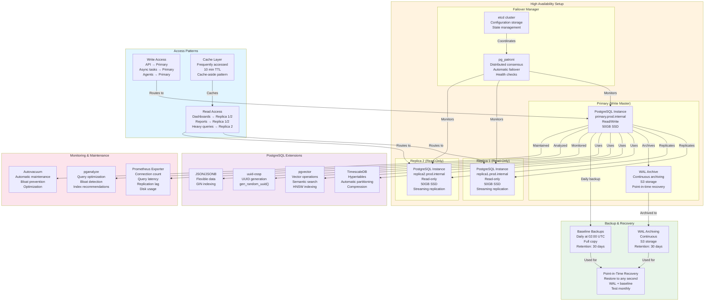
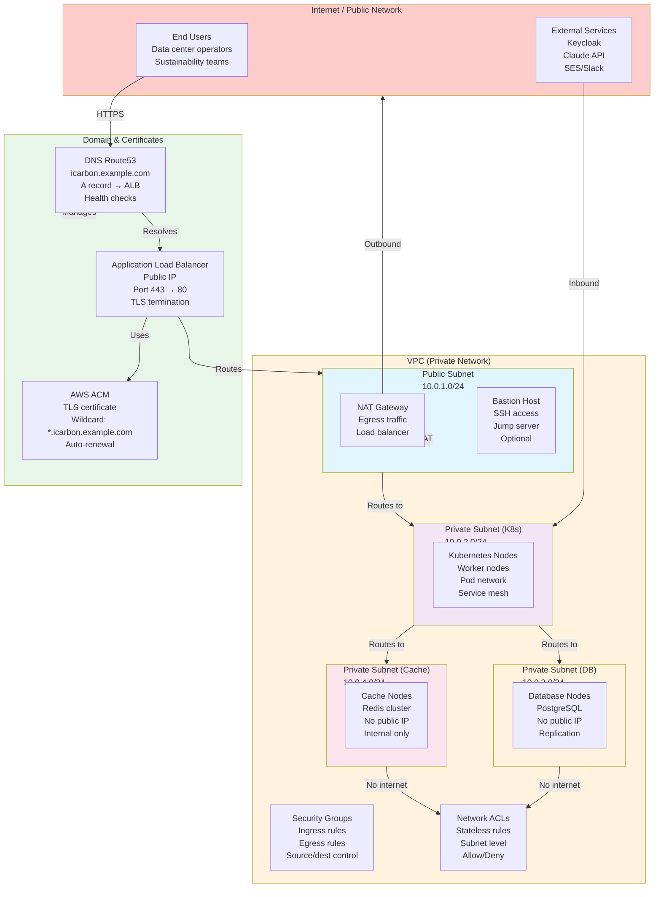

# Deployment Diagram

**Purpose**: Infrastructure topology and deployment architecture
**Format**: Mermaid Deployment Diagrams
**Last Updated**: March 9, 2026

---

## 1. Development Environment (Docker Compose)

```mermaid
graph TB
    subgraph DockerHost["Docker Host (Local Machine)"]
        subgraph Frontend["Frontend Container"]
            React["React Dev Server<br/>Port: 3000<br/>Webpack HMR<br/>Mock API"]
            Node["Node.js Runtime<br/>npm start<br/>Development mode"]
        end

        subgraph Backend["Backend Container"]
            FastAPI["FastAPI App<br/>Port: 8000<br/>Uvicorn Server<br/>Hot reload"]
            Python["Python 3.11+<br/>Virtual env<br/>Dependencies"]
        end

        subgraph Database["Database Container"]
            Postgres["PostgreSQL 15<br/>Port: 5432<br/>Dev database<br/>Test data"]
            TimescaleDB["TimescaleDB<br/>Extension enabled<br/>Hypertables<br/>Compression"]
            pgvector["pgvector<br/>Extension enabled<br/>Vector ops"]
        end

        subgraph Cache["Cache Container"]
            Redis["Redis 7<br/>Port: 6379<br/>In-memory<br/>No persistence"]
        end

        subgraph MessageBus["Message Bus Container"]
            Zookeeper["Zookeeper<br/>Port: 2181<br/>Coordination"]
            Kafka["Kafka Broker<br/>Port: 9092<br/>Single node<br/>Test topics"]
        end

        subgraph Auth["Auth Container"]
            Keycloak["Keycloak Server<br/>Port: 8080<br/>Dev realm<br/>Test users"]
            KeycloakDB["Keycloak DB<br/>PostgreSQL<br/>Embedded"]
        end

        subgraph Storage["Storage Container"]
            MinIO["MinIO Server<br/>Port: 9000<br/>S3-compatible<br/>Local storage"]
        end

        subgraph Monitoring["Monitoring Containers"]
            Prometheus["Prometheus<br/>Port: 9090<br/>Metrics collection"]
            Grafana["Grafana<br/>Port: 3001<br/>Dashboards"]
        end

        subgraph Network["Docker Network: icarbon-network"]
            NetworkBridge["Bridge Network<br/>All containers connected<br/>Service discovery"]
        end
    end

    subgraph Volume["Volumes"]
        DBVolume["PostgreSQL Volume<br/>/var/lib/postgresql"]
        KafkaVolume["Kafka Volume<br/>/var/lib/kafka"]
        MinIOVolume["MinIO Volume<br/>/minio/data"]
        LogVolume["Log Volume<br/>/app/logs"]
    end

    React -->|HTTP| Node
    FastAPI -->|HTTP| Python
    Postgres -->|TCP| Database
    TimescaleDB -->|Extension| Postgres
    pgvector -->|Extension| Postgres
    Redis -->|TCP| Cache
    Zookeeper -->|TCP| MessageBus
    Kafka -->|TCP| MessageBus
    Keycloak -->|HTTP| Auth
    KeycloakDB -->|DB| Auth
    MinIO -->|S3 API| Storage
    Prometheus -->|Scrape| Backend
    Grafana -->|Query| Prometheus

    Backend -->|Connects| NetworkBridge
    Frontend -->|Connects| NetworkBridge
    Database -->|Connects| NetworkBridge
    Cache -->|Connects| NetworkBridge
    MessageBus -->|Connects| NetworkBridge
    Auth -->|Connects| NetworkBridge
    Storage -->|Connects| NetworkBridge

    Postgres -->|Persists| DBVolume
    Kafka -->|Persists| KafkaVolume
    MinIO -->|Persists| MinIOVolume
    Backend -->|Writes| LogVolume

    style Frontend fill:#e3f2fd
    style Backend fill:#f3e5f5
    style Database fill:#fff3e0
    style Cache fill:#fce4ec
    style MessageBus fill:#e8f5e9
    style Auth fill:#f1f8e9
    style Storage fill:#ede7f6
    style Monitoring fill:#fff9c4
```

---

## 2. Production Kubernetes Cluster

```mermaid
graph TB
    subgraph Cluster["Kubernetes Cluster<br/>HA Multi-AZ"]
        subgraph Ingress["Ingress Layer"]
            IGW["Internet Gateway"]
            NginxIngress["Nginx Ingress Controller<br/>TLS termination<br/>Rate limiting<br/>WAF rules"]
            DNSRoute["DNS Route53<br/>icarbon.example.com<br/>Health checks"]
        end

        subgraph APILayer["API Layer (Default NS)"]
            subgraph APIDeployment["API Deployment<br/>StatelessSet"]
                APIPod1["API Pod 1<br/>FastAPI container<br/>2 CPU, 4GB RAM<br/>Port: 8000"]
                APIPod2["API Pod 2<br/>FastAPI container<br/>2 CPU, 4GB RAM<br/>Port: 8000"]
                APIPod3["API Pod 3<br/>FastAPI container<br/>2 CPU, 4GB RAM<br/>Port: 8000"]
            end
            APIHPA["HPA<br/>Min: 3, Max: 10<br/>CPU: 70%"]
            APISvc["API Service<br/>ClusterIP<br/>Port: 8000<br/>Load balanced"]
        end

        subgraph WorkerLayer["Worker Layer (Workers NS)"]
            subgraph CeleryDeployment["Celery Deployment<br/>Deployment"]
                WorkerPod1["Worker Pod 1<br/>Celery worker<br/>1 CPU, 2GB RAM"]
                WorkerPod2["Worker Pod 2<br/>Celery worker<br/>1 CPU, 2GB RAM"]
            end
            WorkerHPA["HPA<br/>Min: 2, Max: 5<br/>Queue depth"]
            WorkerSvc["Worker Service<br/>Headless<br/>Internal only"]
        end

        subgraph AgentLayer["Agent Layer (Agents NS)"]
            subgraph AgentDeployment["Agent Deployment<br/>Deployment"]
                AgentPod1["Agent Pod 1<br/>Telemetry Agent<br/>Carbon Agent<br/>1 CPU, 2GB RAM"]
                AgentPod2["Agent Pod 2<br/>Compliance Agent<br/>Evidence Agent<br/>1 CPU, 2GB RAM"]
            end
            AgentHPA["HPA<br/>Min: 2, Max: 4<br/>Event rate"]
            AgentSvc["Agent Service<br/>Internal<br/>Kafka consumers"]
        end

        subgraph Database["Database Layer (Data NS)"]
            subgraph StatefulSet["StatefulSet: PostgreSQL"]
                PrimaryPod["Primary Pod<br/>PostgreSQL 15<br/>50GB SSD<br/>Read/Write master"]
                ReplicaPod1["Replica Pod 1<br/>PostgreSQL 15<br/>50GB SSD<br/>Read-only"]
                ReplicaPod2["Replica Pod 2<br/>PostgreSQL 15<br/>50GB SSD<br/>Read-only"]
            end
            PGService["PostgreSQL Service<br/>Headless<br/>Port: 5432"]
            PGBackup["Backup Pod<br/>pg_dump daily<br/>S3 upload<br/>Point-in-time recovery"]
        end

        subgraph Cache["Cache Layer"]
            RedisCluster["Redis Cluster<br/>3 master, 3 replica<br/>Sentinel<br/>10GB memory"]
            RedisSvc["Redis Service<br/>Port: 6379<br/>High availability"]
        end

        subgraph MessageBus["Message Bus"]
            KafkaCluster["Kafka Cluster<br/>3 brokers<br/>Replication factor: 3<br/>100GB storage"]
            ZKCluster["Zookeeper Ensemble<br/>3 nodes<br/>Coordination"]
        end

        subgraph Storage["Object Storage"]
            S3["AWS S3 Bucket<br/>icarbon-prod<br/>Versioning enabled<br/>Encryption at rest<br/>MFA delete"]
            S3Backup["Backup S3<br/>Cross-region<br/>Versioning<br/>Lifecycle rules"]
        end

        subgraph Monitoring["Monitoring"]
            Prometheus["Prometheus<br/>StatefulSet<br/>30-day retention<br/>Auto-scraped"]
            Grafana["Grafana<br/>Deployment<br/>Dashboards<br/>On-call view"]
            AlertManager["AlertManager<br/>Rule evaluation<br/>Slack/PagerDuty"]
            Loki["Loki<br/>Log aggregation<br/>Logql queries"]
            Jaeger["Jaeger<br/>Distributed tracing<br/>Latency analysis"]
        end

        subgraph Registry["Container Registry"]
            ECR["AWS ECR<br/>Image storage<br/>Image scanning<br/>Version tags"]
        end

        subgraph ConfigSecrets["Config & Secrets"]
            ConfigMap["ConfigMap<br/>Non-sensitive config<br/>Environment overrides"]
            Secrets["Secrets<br/>DB passwords<br/>API keys<br/>Encryption keys"]
            VaultInt["Vault Integration<br/>Key rotation<br/>Audit trail"]
        end
    end

    subgraph External["External Services"]
        Keycloak["Keycloak<br/>Managed service<br/>OAuth2/OIDC<br/>HA setup"]
        CloudSQL["Cloud SQL<br/>Backup database<br/>Failover target"]
        SES["AWS SES<br/>Email service<br/>Transactional"]
        SlackInt["Slack<br/>Notifications<br/>Alerts"]
        PagerDuty["PagerDuty<br/>On-call mgmt<br/>Escalations"]
        ClaudeAPI["Claude API<br/>Copilot queries<br/>Embeddings"]
    end

    subgraph Backup["Backup & Disaster Recovery"]
        DBSnapshots["Daily DB Snapshots<br/>EBS snapshots<br/>30-day retention<br/>Geo-redundant"]
        S3Snapshots["S3 snapshots<br/>Cross-region<br/>Versioning"]
        RecoveryTest["Monthly Recovery Test<br/>Automated restoration<br/>Validation"]
    end

    DNSRoute -->|Routes to| NginxIngress
    NginxIngress -->|Routes to| APISvc
    APISvc -->|Balances| APIDeployment
    APIDeployment -->|Scales via| APIHPA

    APIDeployment -->|Reads/Writes| PGService
    APIDeployment -->|Caches| RedisSvc
    APIDeployment -->|Publishes| KafkaCluster
    APIDeployment -->|Gets config| ConfigMap
    APIDeployment -->|Gets secrets| Secrets

    WorkerDeployment -->|Consumes| KafkaCluster
    WorkerDeployment -->|Updates| PGService
    WorkerDeployment -->|Stores| S3

    AgentDeployment -->|Consumes| KafkaCluster
    AgentDeployment -->|Writes| PGService
    AgentDeployment -->|Uses| ClaudeAPI

    PGService -->|Master-Replica| StatefulSet
    StatefulSet -->|Backup| PGBackup
    PGBackup -->|Uploads| S3
    PrimaryPod -->|Snapshot| DBSnapshots
    DBSnapshots -->|Archive| S3Snapshots

    Prometheus -->|Scrapes| APIDeployment
    Prometheus -->|Scrapes| WorkerDeployment
    Prometheus -->|Scrapes| PGService
    Prometheus -->|Scrapes| RedisCluster
    Prometheus -->|Scrapes| KafkaCluster

    Grafana -->|Queries| Prometheus
    Loki -->|Aggregates| WorkerDeployment
    AlertManager -->|Triggers| SlackInt
    AlertManager -->|Triggers| PagerDuty

    ECR -->|Pulls| APIDeployment
    ECR -->|Pulls| WorkerDeployment
    ECR -->|Pulls| AgentDeployment

    APIDeployment -->|Authenticates| Keycloak
    APIDeployment -->|Sends email| SES

    style Cluster fill:#fff3e0
    style APILayer fill:#e3f2fd
    style WorkerLayer fill:#f3e5f5
    style AgentLayer fill:#e8f5e9
    style Database fill:#fff3e0
    style Cache fill:#fce4ec
    style MessageBus fill:#f1f8e9
    style Storage fill:#ede7f6
    style Monitoring fill:#fff9c4
    style External fill:#e0f2f1
    style Backup fill:#ffe0b2
```

---

## 3. Multi-Tenant Data Isolation Architecture

```mermaid
graph TB
    subgraph Shared["Shared Infrastructure"]
        SingleCluster["Single Kubernetes Cluster<br/>Namespaces per environment<br/>Shared compute resources<br/>Cost efficient"]
        SharedDB["Single PostgreSQL Cluster<br/>Replication for HA<br/>Row-level security<br/>Tenant ID scoping"]
        SharedCache["Shared Redis Cluster<br/>Namespaced keys<br/>TTL per tenant"]
    end

    subgraph Isolation["Tenant Isolation Mechanisms"]
        DBScoping["Database Scoping<br/>WHERE tenant_id = $1<br/>On every query<br/>RLS policies"]
        APIScoping["API Scoping<br/>Extract tenant ID<br/>Middleware validation<br/>Scoped responses"]
        CacheNS["Cache Namespacing<br/>Key: tenant_{id}_{resource}<br/>Isolation in Redis<br/>TTL separate"]
        FileScoping["File Storage Scoping<br/>S3 prefix: tenant/{id}<br/>Bucket policies<br/>Access control"]
    end

    subgraph DataLayout["Data Organization"]
        CoreTables["Core Tables<br/>tenant_id index<br/>Organization<br/>Users<br/>Settings"]
        TelemetryTables["Telemetry Tables<br/>Tenant partitioned<br/>TimescaleDB hypertables<br/>Compression by tenant"]
        MetricsTables["Metrics Tables<br/>Tenant partitioned<br/>KPI snapshots<br/>Carbon data"]
        PrivacyTables["Privacy Data<br/>Audit logs<br/>Approval records<br/>Tenant encrypted"]
    end

    subgraph Quotas["Tenant Quotas & Limits"]
        APIQuota["API Rate Limits<br/>Per-tenant bucket<br/>100 req/sec<br/>Burst: 500"]
        StorageQuota["Storage Quota<br/>Per-tenant limit<br/>100GB S3 data<br/>Monitoring & alerts"]
        ComputeQuota["Compute Quota<br/>Pod resource limits<br/>Memory: 4GB pod<br/>CPU: 2 cores"]
        DataQuota["Data Retention<br/>Telemetry: 3 years<br/>Audit logs: 7 years<br/>Soft delete: 30 days"]
    end

    subgraph Monitoring["Tenant Monitoring"]
        TenantMetrics["Per-Tenant Metrics<br/>API calls<br/>Data ingested<br/>Storage used<br/>Compute consumed"]
        AnomalyDetection["Anomaly Detection<br/>Unusual access patterns<br/>Data exfiltration<br/>Resource hogging"]
        AuditLogging["Audit Trail<br/>All operations<br/>User attribution<br/>Timestamp<br/>IP address"]
    end

    SingleCluster -->|Uses| SharedDB
    SingleCluster -->|Uses| SharedCache
    SharedDB -->|Implements| DBScoping
    SharedDB -->|Implements| CacheNS
    APIScoping -->|Enforces| SingleCluster
    FileScoping -->|Organizes| SharedDB

    CoreTables -->|Contains| DataLayout
    TelemetryTables -->|Contains| DataLayout
    MetricsTables -->|Contains| DataLayout
    PrivacyTables -->|Contains| DataLayout

    APIQuota -->|Limits| SingleCluster
    StorageQuota -->|Limits| SharedDB
    ComputeQuota -->|Limits| SingleCluster
    DataQuota -->|Governs| SharedDB

    TenantMetrics -->|Monitors| SingleCluster
    AnomalyDetection -->|Monitors| DataLayout
    AuditLogging -->|Records| PrivacyTables

    style Shared fill:#e1f5ff
    style Isolation fill:#f3e5f5
    style DataLayout fill:#fff3e0
    style Quotas fill:#e8f5e9
    style Monitoring fill:#fce4ec
```

---

## 4. Database Deployment Architecture

---

## 5. Network Topology

---

## Deployment Checklist

### Pre-Deployment
- [ ] Infrastructure provisioned (Kubernetes, databases, networks)
- [ ] Secrets configured (passwords, keys, certificates)
- [ ] Database migrations applied
- [ ] Service account permissions set
- [ ] Network policies configured
- [ ] Monitoring alerts created
- [ ] Backup procedures tested

### Deployment
- [ ] Pull latest images from registry
- [ ] Apply ConfigMaps and Secrets
- [ ] Deploy stateless services (API, Workers)
- [ ] Verify health checks
- [ ] Deploy stateful services (Database replicas)
- [ ] Verify replication
- [ ] Deploy monitoring stack
- [ ] Run smoke tests

### Post-Deployment
- [ ] Verify all pods running
- [ ] Check monitoring dashboards
- [ ] Validate metrics flowing
- [ ] Run integration tests
- [ ] Test failover scenarios
- [ ] Document deployment
- [ ] Create incident runbooks

---

**Navigation**: [Back to Index](./INDEX.md)
