# Domain Model Diagrams

**Purpose**: Entity and class relationships showing all domain objects in iNetZero
**Format**: Mermaid UML Class Diagrams
**Last Updated**: March 9, 2026

---

## 1. Core Tenant & Organization Entities

```mermaid
classDiagram
    class Tenant {
        +UUID id
        +String name
        +String slug
        +String description
        +String status
        +DateTime created_at
        +String created_by
        +DateTime updated_at
        +String updated_by
        +DateTime deleted_at
    }

    class Organization {
        +UUID id
        +UUID tenant_id
        +String name
        +String address
        +String timezone
        +String reporting_units
        +String status
        +DateTime created_at
        +String created_by
        +DateTime updated_at
        +String updated_by
    }

    class Site {
        +UUID id
        +UUID org_id
        +String name
        +String location
        +Float latitude
        +Float longitude
        +String status
        +DateTime created_at
    }

    class Building {
        +UUID id
        +UUID site_id
        +String name
        +String floor_count
        +Float square_meters
        +DateTime created_at
    }

    class Zone {
        +UUID id
        +UUID building_id
        +String name
        +String zone_type
        +Float area
        +DateTime created_at
    }

    class Rack {
        +UUID id
        +UUID zone_id
        +String rack_id
        +Integer u_count
        +Float power_capacity_kw
        +DateTime created_at
    }

    Tenant "1" -- "*" Organization
    Organization "1" -- "*" Site
    Site "1" -- "*" Building
    Building "1" -- "*" Zone
    Zone "1" -- "*" Rack
```

---

## 2. Asset & Device Entities

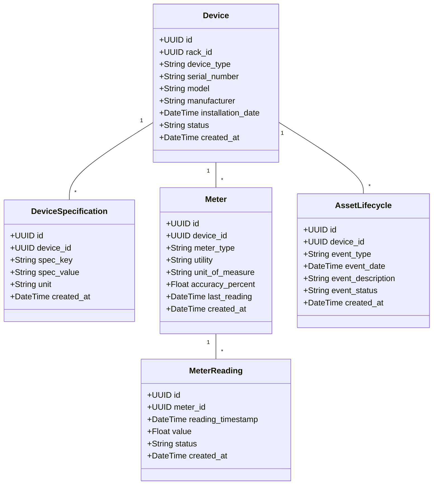

---

## 3. Telemetry Entities

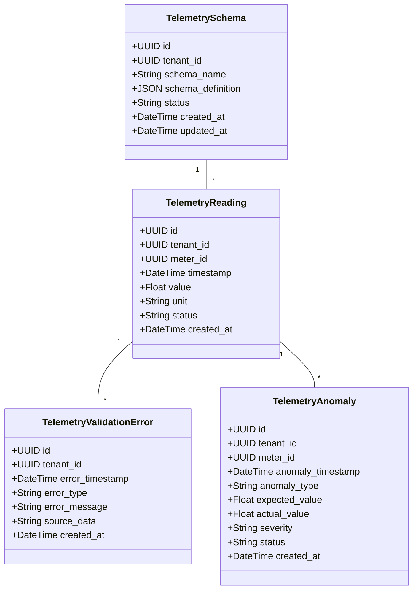

---

## 4. Energy & Carbon Entities

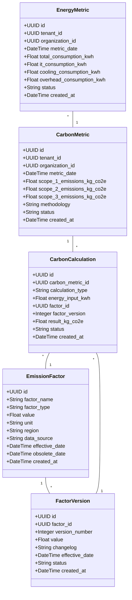

---

## 5. KPI Entities

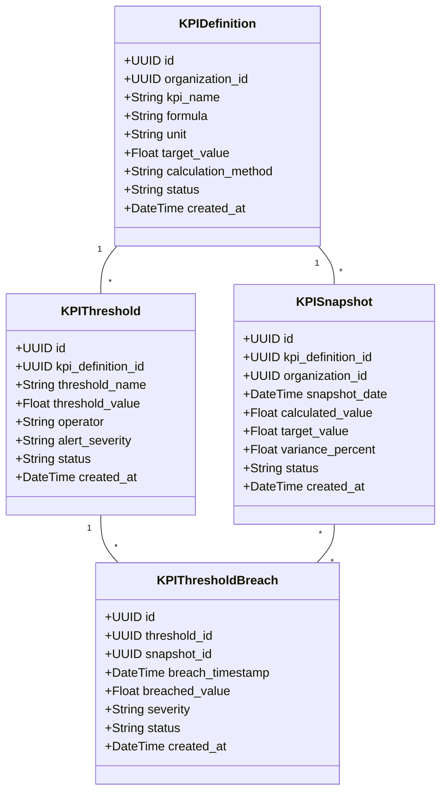

---

## 6. Evidence Repository Entities

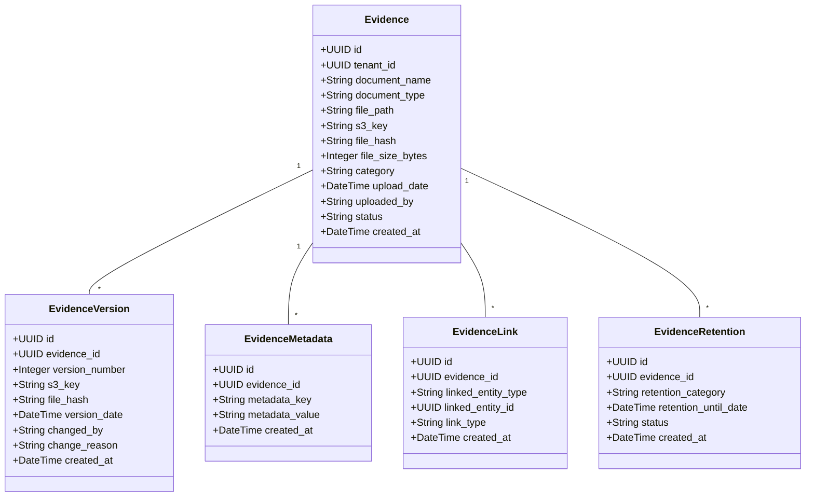

---

## 7. Workflow & Approval Entities

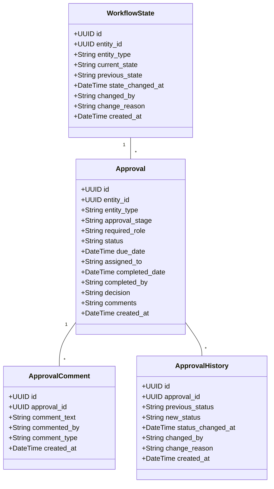

---

## 8. Report & Reporting Entities

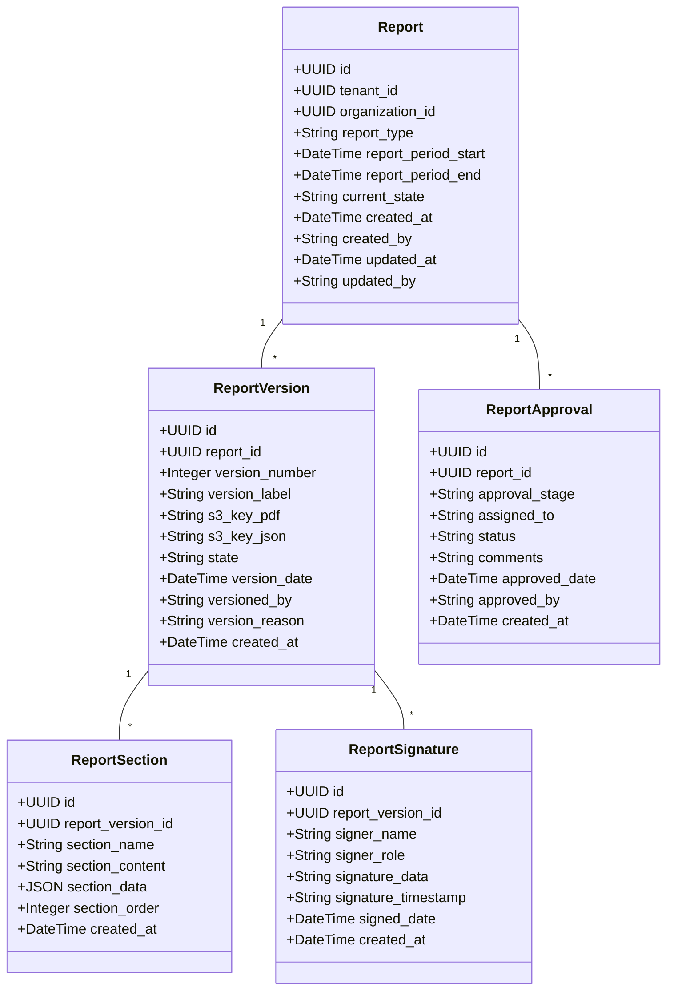

---

## 9. User & Authorization Entities

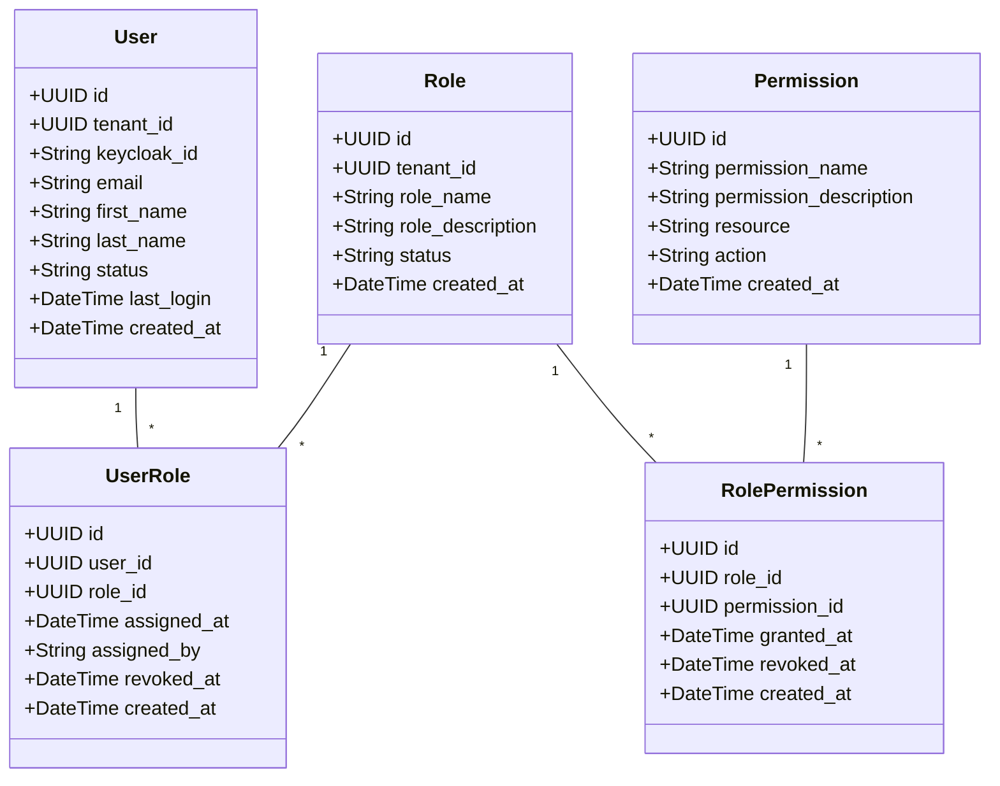

---

## 10. Audit & Compliance Entities

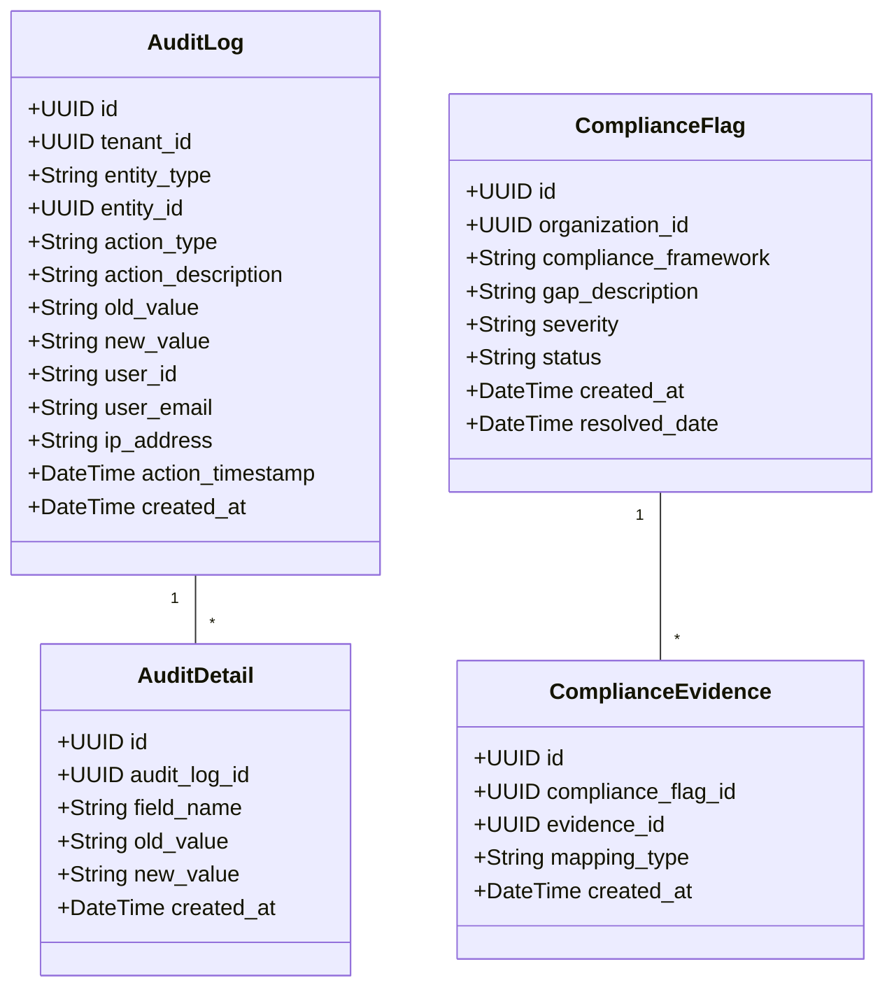

---

## 11. Agent Execution & Logging Entities

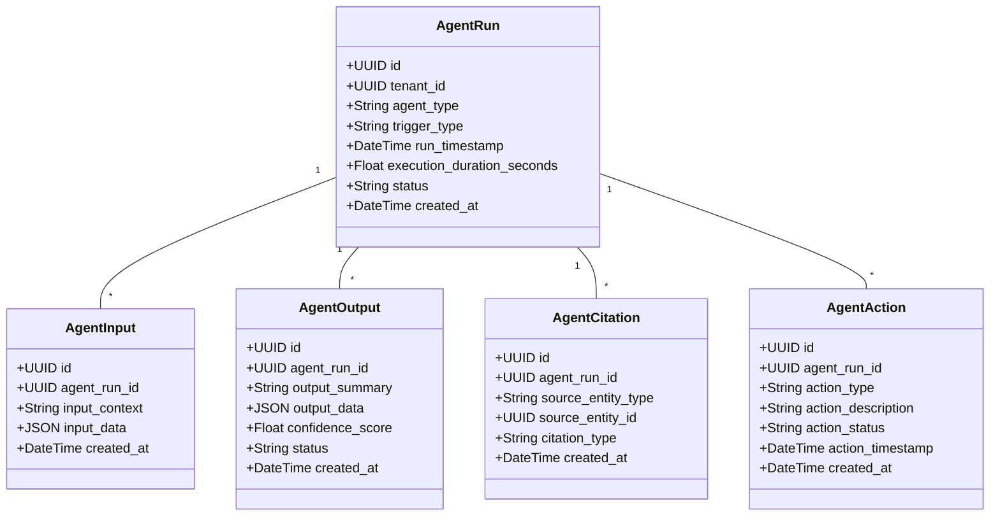

---

## 12. Copilot & Vector Search Entities

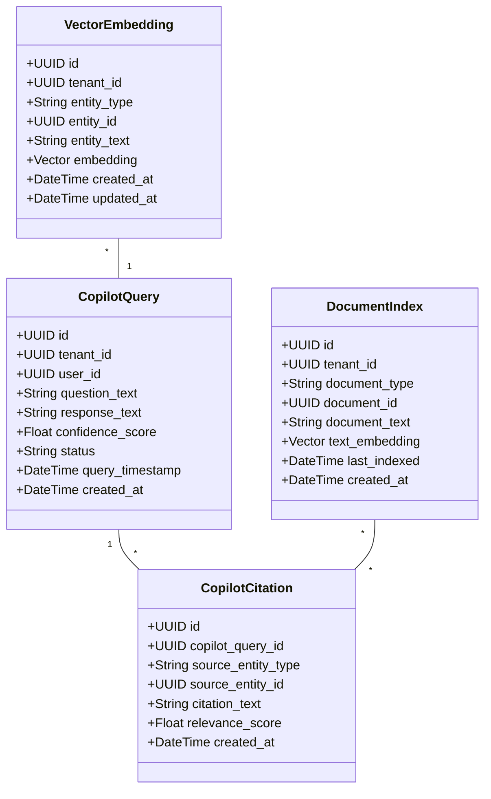

---

## Relationship Summary

```
Tenant (Root)
├── Organization
│   ├── Site → Building → Zone → Rack → Device
│   │                                      ├── Meter → MeterReading
│   │                                      ├── DeviceSpecification
│   │                                      └── AssetLifecycle
│   │
│   ├── EnergyMetric → CarbonMetric → CarbonCalculation
│   │                                      └── EmissionFactor
│   │
│   ├── KPIDefinition → KPISnapshot → KPIThresholdBreach
│   │                                      └── KPIThreshold
│   │
│   └── Report → ReportVersion → ReportSection
│                                   ├── ReportApproval
│                                   └── ReportSignature
│
├── User → UserRole → Role → RolePermission → Permission
│
├── Evidence → EvidenceVersion, EvidenceMetadata, EvidenceLink, EvidenceRetention
│
├── WorkflowState → Approval → ApprovalComment, ApprovalHistory
│
├── AuditLog → AuditDetail
│
├── AgentRun → AgentInput, AgentOutput, AgentCitation, AgentAction
│
└── CopilotQuery → CopilotCitation
```

---

**Key Design Patterns**:
- ✅ Soft deletes (deleted_at fields)
- ✅ Audit fields (created_by, updated_by, created_at, updated_at)
- ✅ Immutable versions (Version tables for tracking changes)
- ✅ Tenant isolation (tenant_id on all customer-scoped entities)
- ✅ Status tracking (status field for state machines)
- ✅ Extensibility (metadata tables, custom KPIs)
- ✅ Traceability (audit logs, citations, lineage)

---

**Navigation**: [Back to Index](./INDEX.md)
