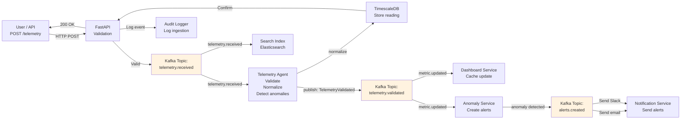
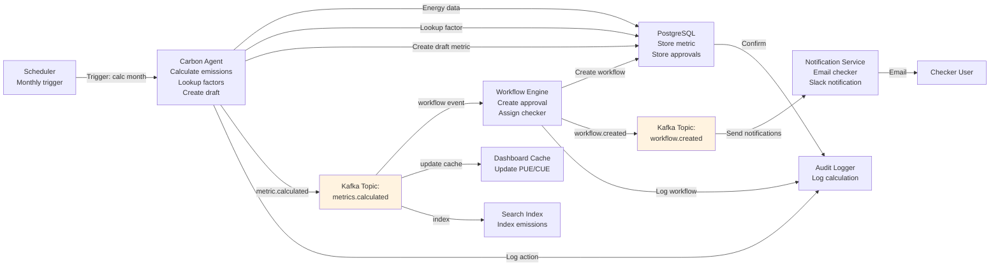
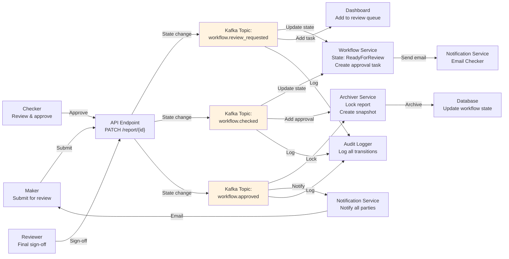
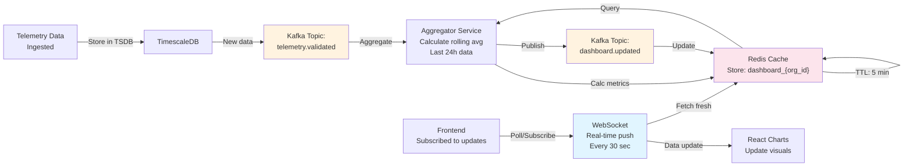
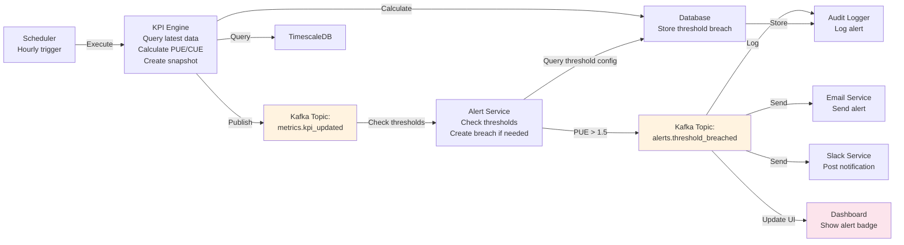
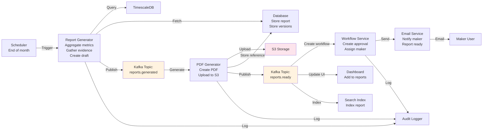
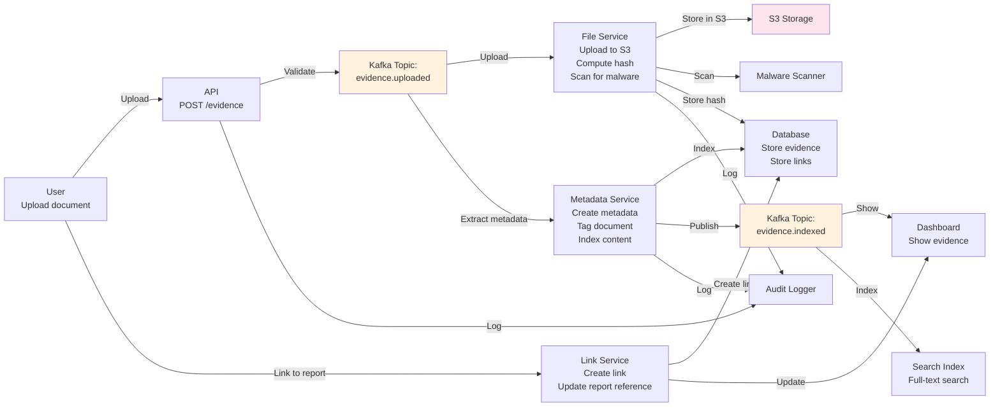
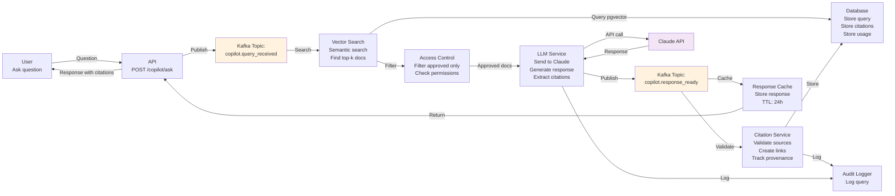
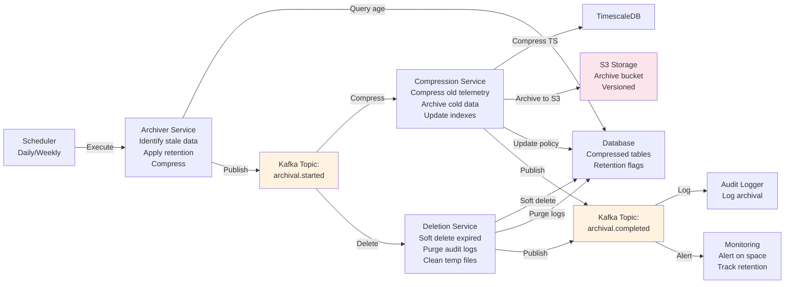

# Event Flow Diagrams

**Purpose**: Asynchronous event-driven workflows
**Format**: Mermaid Graph Diagrams
**Last Updated**: March 9, 2026

---

## 1. Telemetry Ingestion Event Flow

---

## 2. Carbon Calculation Event Flow

---

## 3. Approval Workflow Event Flow

---

## 4. Real-time Dashboard Update Event Flow

---

## 5. KPI Threshold Alert Event Flow

---

## 6. Report Generation Event Flow

---

## 7. Evidence Upload & Linking Event Flow

---

## 8. Copilot Query Processing Event Flow

---

## 9. Agent Orchestration Event Flow

```mermaid
graph LR
    Trigger["Trigger<br/>Scheduled/Manual"]

    Orchestrator["Agent Orchestrator<br/>Determine agents<br/>Get prerequisites<br/>Sequence execution"]

    Kafka1["Kafka Topic:<br/>agents.execute"]

    AgentWorkers["Agent Workers<br/>Consume jobs<br/>Execute agents<br/>Produce results"]

    Kafka2["Kafka Topic:<br/>agents.completed"]

    PostProcessor["Post-Processor<br/>Validate results<br/>Store outputs<br/>Link citations"]

    Database["Database<br/>Store agent runs<br/>Store results<br/>Store citations"]

    Notification["Notification<br/>Alert if needed<br/>Log completion"]

    Auditor["Audit Logger<br/>Log execution"]

    Trigger -->|Start| Orchestrator
    Orchestrator -->|Check prerequisites| Database
    Orchestrator -->|Sequence agents| Kafka1

    Kafka1 -->|Telemetry Agent| AgentWorkers
    Kafka1 -->|Carbon Agent| AgentWorkers
    Kafka1 -->|Compliance Agent| AgentWorkers

    AgentWorkers -->|Results| Kafka2

    Kafka2 -->|Aggregate| PostProcessor
    PostProcessor -->|Validate| Database
    PostProcessor -->|Store| Database

    Database -->|Confirm| Notification
    Notification -->|Log| Auditor

    Orchestrator -->|Log start| Auditor
    AgentWorkers -->|Log execution| Auditor

    style Kafka1 fill:#fff3e0
    style Kafka2 fill:#fff3e0
    style Database fill:#fff3e0
```

---

## 10. Data Archival & Cleanup Event Flow

---

## Event Topic Reference

| Topic | Producer | Consumers | Schema |
|-------|----------|-----------|--------|
| `telemetry.received` | API Ingestion | Validation, Indexing | {reading_id, meter_id, value, timestamp} |
| `telemetry.validated` | Telemetry Agent | Dashboard, Anomaly Detection | {reading_id, status, validation_result} |
| `metrics.calculated` | Carbon Agent | Workflow, Dashboard, Indexing | {metric_id, metric_type, value, status} |
| `metrics.kpi_updated` | KPI Engine | Dashboard, Alerting, Indexing | {kpi_id, value, snapshot_date} |
| `alerts.threshold_breached` | Alert Service | Email, Slack, Dashboard | {alert_id, metric_id, threshold, breach_value} |
| `reports.generated` | Report Generator | Workflow, S3, Indexing | {report_id, period, status} |
| `workflow.review_requested` | API | Notification, Dashboard | {entity_id, entity_type, stage} |
| `workflow.checked` | Workflow Service | Notification, Archiving | {entity_id, checker_id, decision} |
| `workflow.approved` | Workflow Service | Notification, Archiver | {entity_id, reviewer_id, signature} |
| `evidence.uploaded` | API | File Service, Metadata Service | {evidence_id, file_name, file_hash} |
| `evidence.indexed` | Metadata Service | Dashboard, Search | {evidence_id, metadata} |
| `copilot.query_received` | API | Vector Search, Citation | {query_id, question, user_id} |
| `copilot.response_ready` | LLM Service | Citation Service, Cache | {query_id, response, citations} |
| `agents.execute` | Orchestrator | Agent Workers | {run_id, agent_type, input_data} |
| `agents.completed` | Agent Workers | Post-Processor | {run_id, status, output_data} |

---

**Navigation**: [Back to Index](./INDEX.md)
