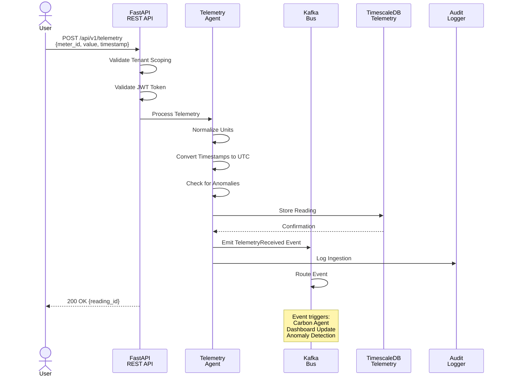
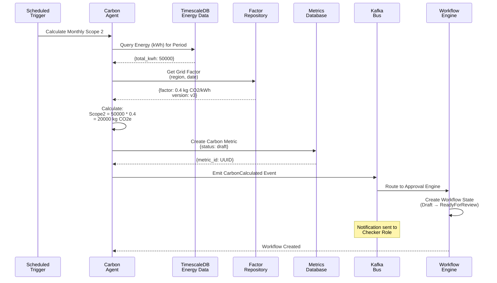
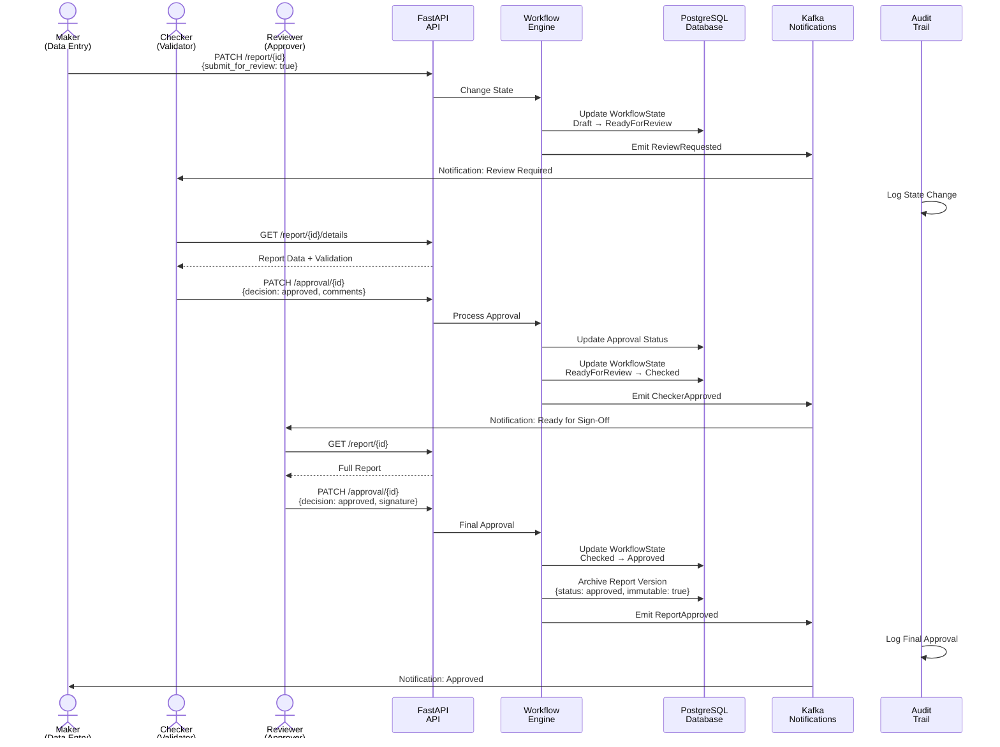
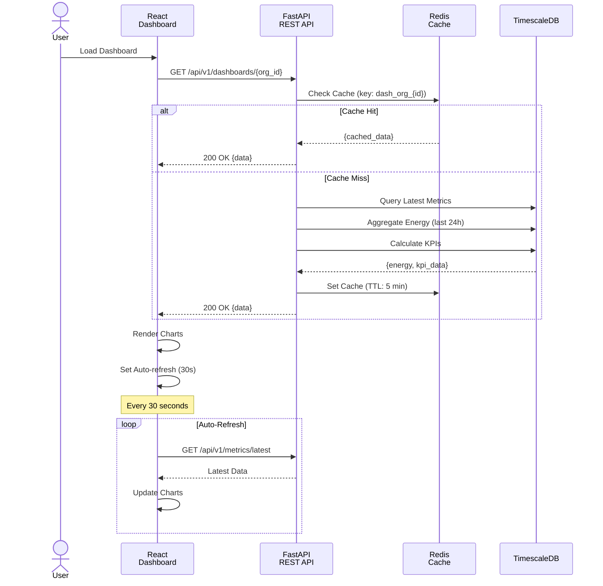
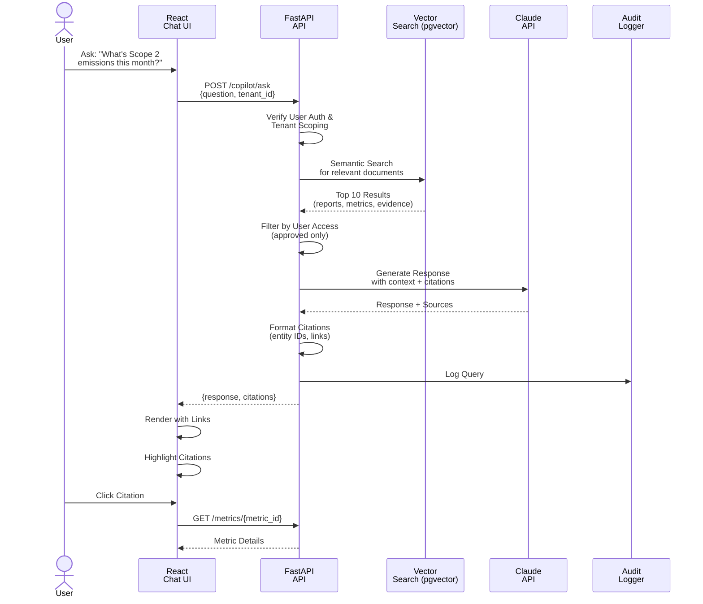
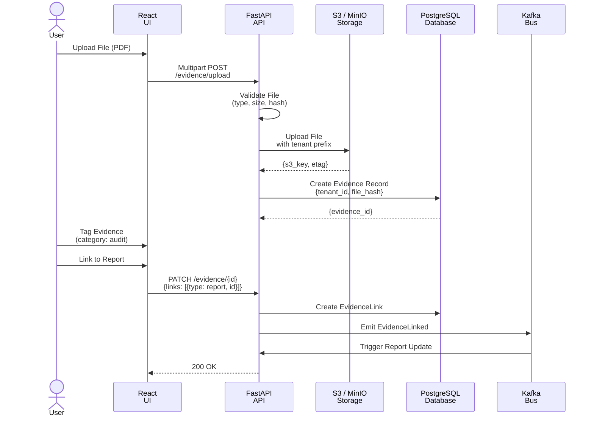
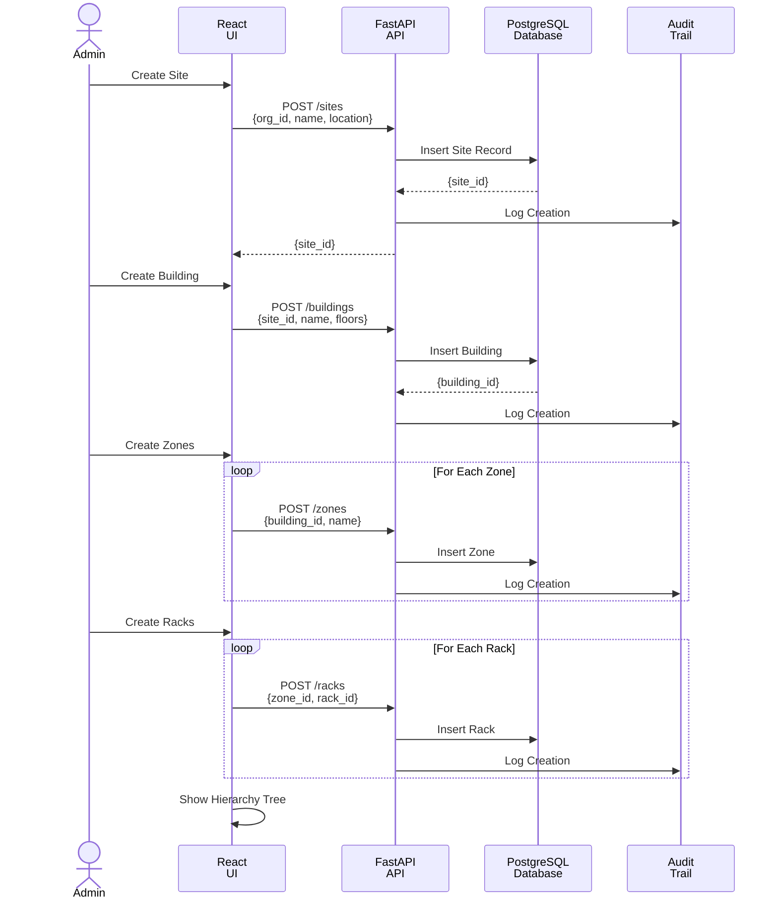
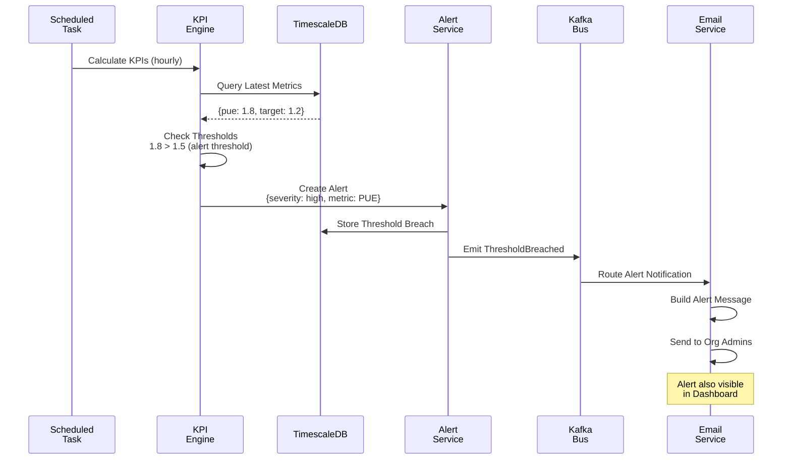
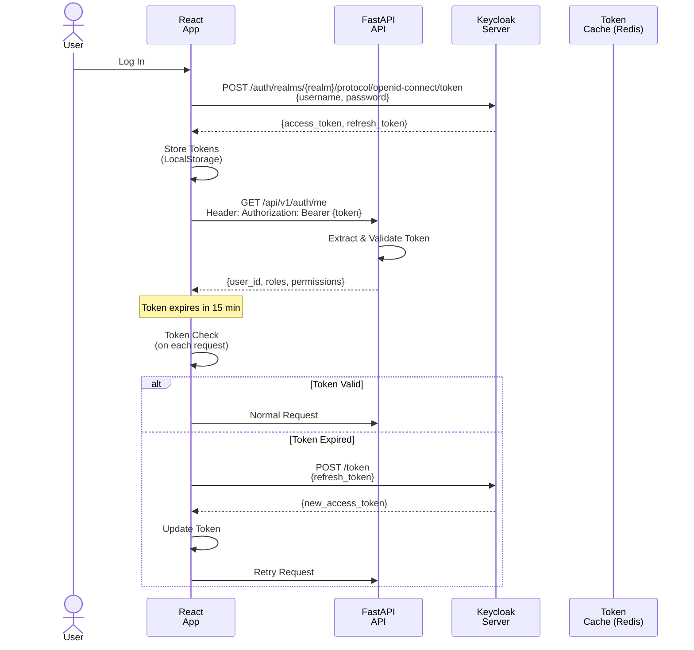
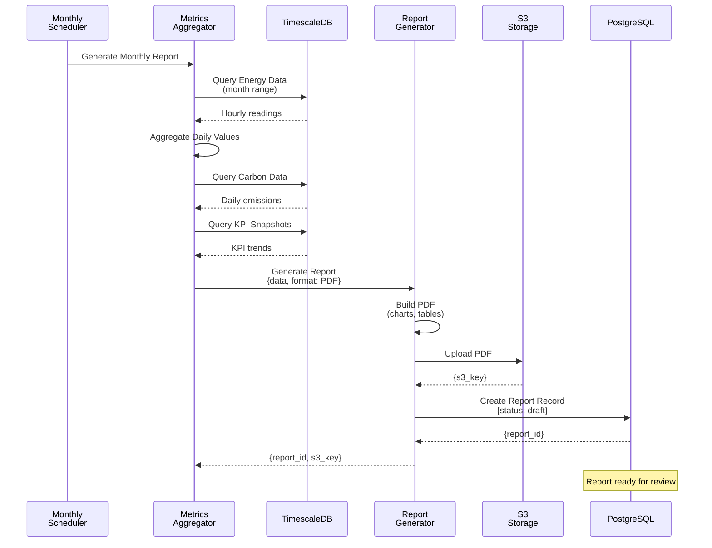

# Sequence Diagrams

**Purpose**: Interactions and flows for critical user journeys
**Format**: Mermaid Sequence Diagrams
**Last Updated**: March 9, 2026

---

## 1. Telemetry Ingestion Sequence



---

## 2. Carbon Calculation Workflow



---

## 3. Approval Workflow Sequence



---

## 4. Dashboard Data Loading (Real-time)



---

## 5. Copilot Query Resolution



---

## 6. Evidence Upload & Linking



---

## 7. Facility Hierarchy Creation



---

## 8. KPI Threshold Alert



---

## 9. Token Refresh & Auth Flow



---

## 10. Metrics Aggregation & Reporting



---

## Interaction Patterns

### Request/Response Pattern
```
Client Request
  ├── Authentication (JWT)
  ├── Tenant Scoping Validation
  ├── Authorization (RBAC)
  ├── Request Validation (Pydantic)
  └── Business Logic
        └── Database Operations
              └── Audit Logging
                    └── Event Emission (Kafka)
                          └── Notification Dispatch
Server Response (JSON with status, data, errors)
```

### Async Event Pattern
```
Synchronous Trigger (API, Scheduled)
  └── Emit Event to Kafka
        ├── Service A subscribes
        ├── Service B subscribes
        └── Service C subscribes
              └── Each processes independently
                    └── Maintains own state
```

### State Machine Pattern
```
Current State + Action
  └── Validate Transition
        └── Apply Side Effects
              └── Emit Events
                    └── Update State
                          └── Audit Log Entry
```

---

**Navigation**: [Back to Index](./INDEX.md)
