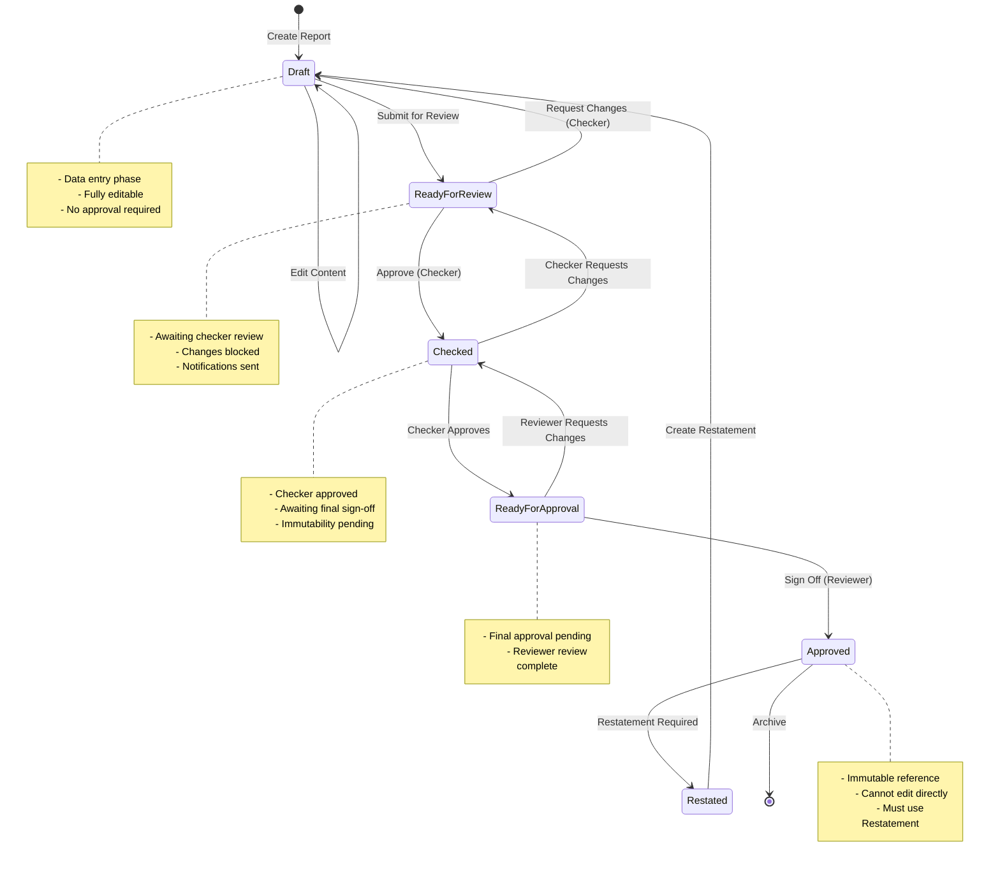
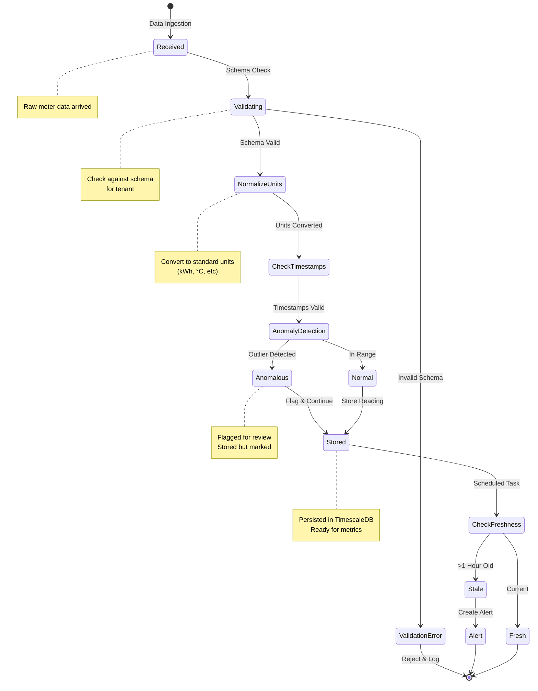
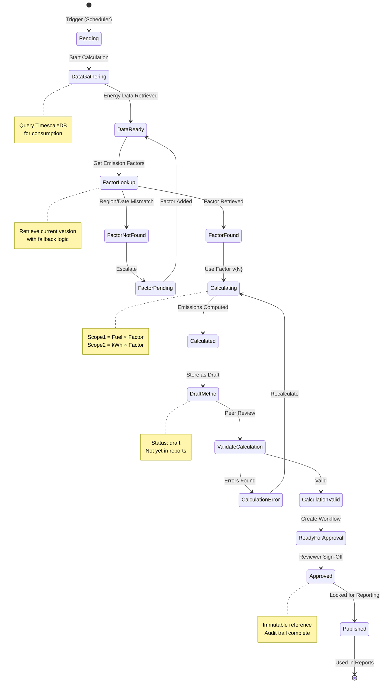
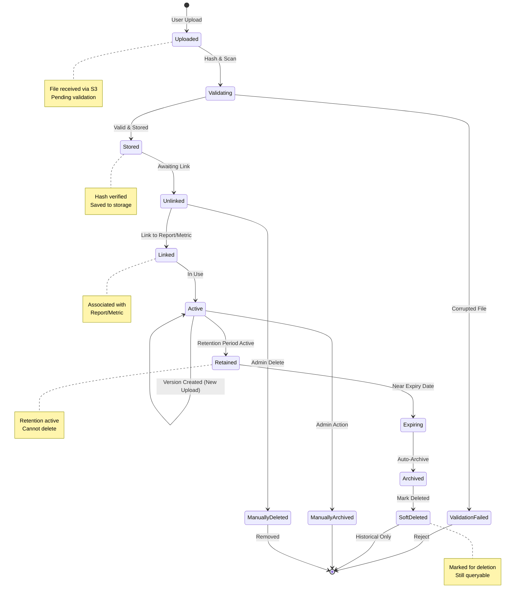
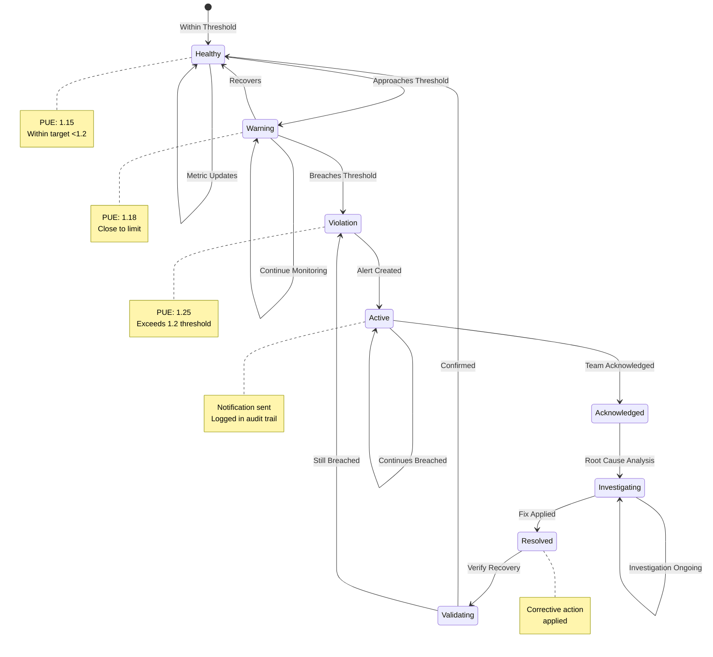
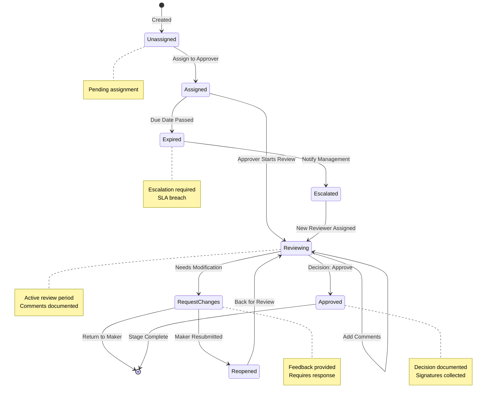
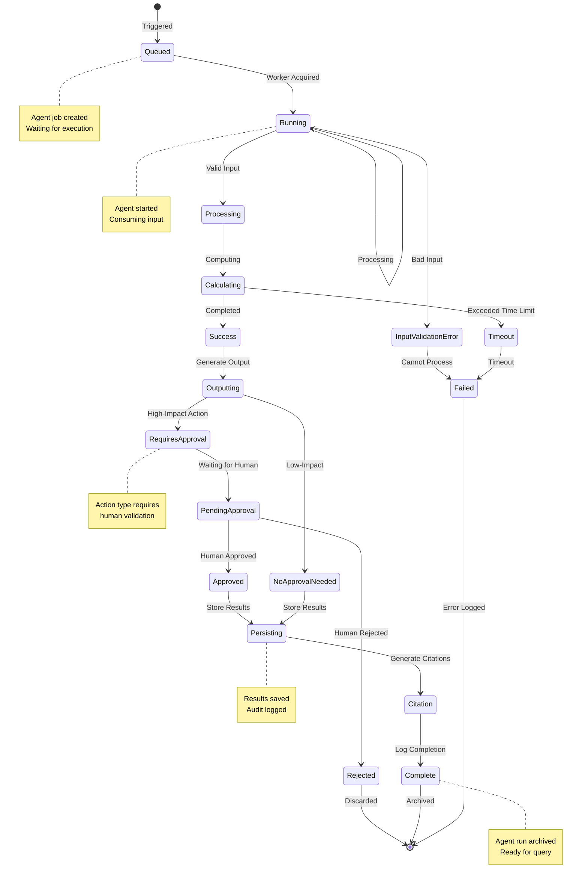
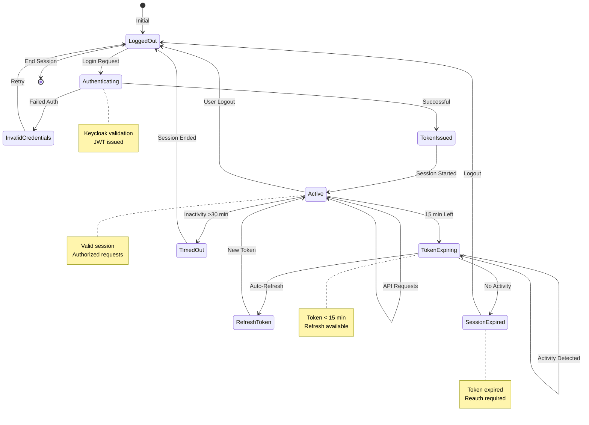
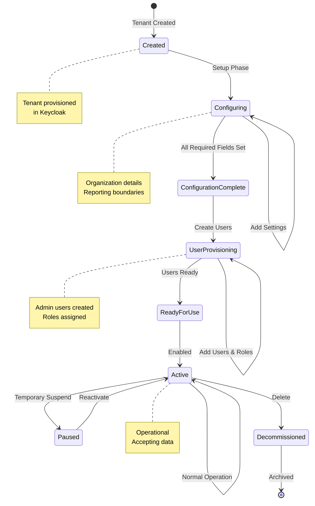
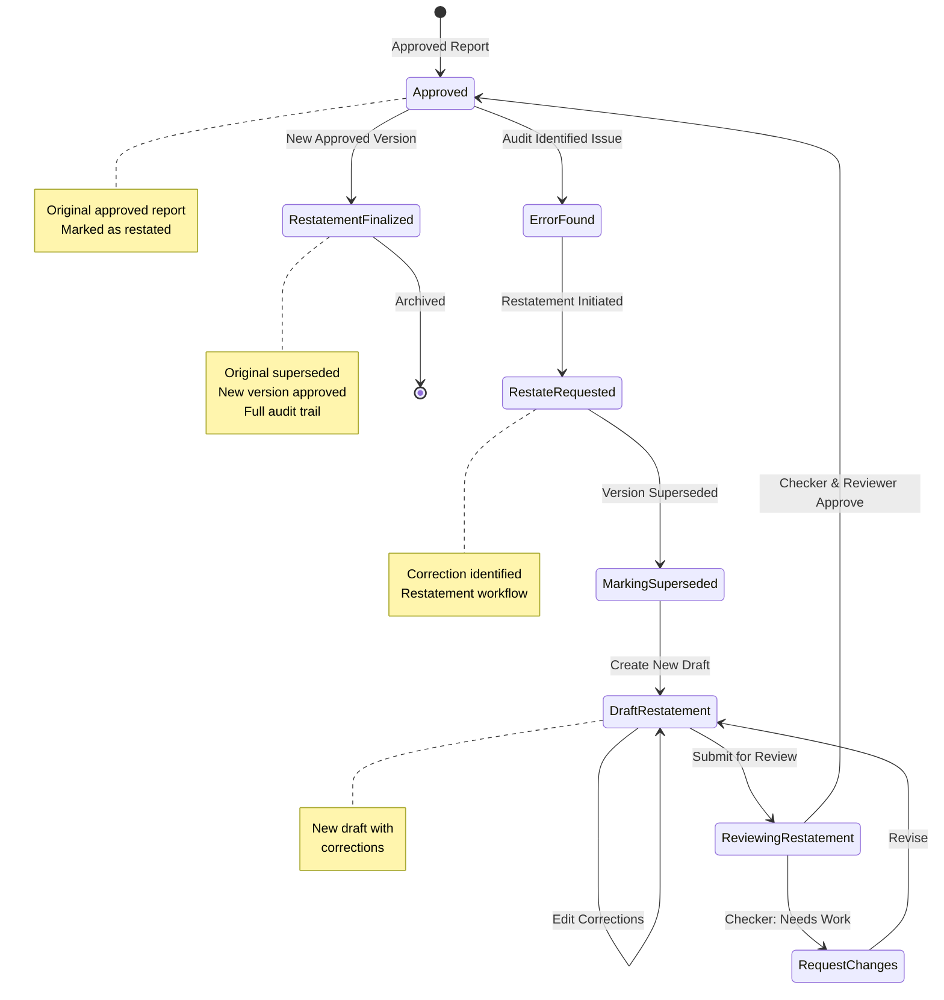

# State Diagrams

**Purpose**: State machines for critical workflows
**Format**: Mermaid State Diagrams
**Last Updated**: March 9, 2026

---

## 1. Report Approval Workflow

---

## 2. Telemetry Data Validation State Machine

---

## 3. Carbon Metric Calculation State Machine

---

## 4. Evidence Lifecycle State Machine

---

## 5. KPI Threshold Violation State Machine

---

## 6. Approval Stage State Machine

---

## 7. Agent Execution State Machine

---

## 8. User Session State Machine

---

## 9. Organization Onboarding State Machine

---

## 10. Report Restatement State Machine

---

## State Machine Transitions Summary

| Workflow | Initial | Terminal | Key Transitions | Approval Required? |
|----------|---------|----------|-----------------|-------------------|
| **Report** | Draft | Approved/Archived | Draft → Review → Check → Approved | Yes (2 stages) |
| **Telemetry** | Received | Stored | Validate → Normalize → Detect → Store | No |
| **Carbon** | Pending | Published | Calculate → Validate → Approve | Yes (1 stage) |
| **Evidence** | Uploaded | Archived | Upload → Link → Retain → Archive | No |
| **KPI** | Healthy | Resolved | Normal → Warning → Violation → Resolved | No (alert only) |
| **Agent** | Queued | Complete | Queue → Run → Process → Output → Store | Optional |
| **User** | LoggedOut | LoggedOut | Auth → Active → Refresh → Logout | No |

---

**Navigation**: [Back to Index](./INDEX.md)
